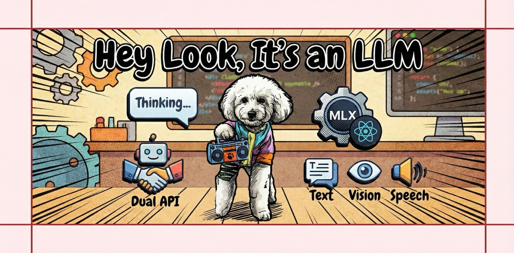

# Hey Look, It's an LLM

<p align="center">
  <a href="assets/heylookitsanllm.jpeg">
    
  </a>
  <br>
</p>

Local multimodal LLM API server with dual OpenAI-compatible and Anthropic Messages-style endpoints, a React web UI, and on-the-fly model swapping.

Built on Apple MLX for text and vision.

## Key Features

- **Dual API**: OpenAI-compatible `/v1/chat/completions` and Anthropic Messages-style `/v1/messages` with typed content blocks (text, image, thinking, logprobs, hidden states)
- **Multi-Provider**:
  - **MLX**: Text and vision-language models on Apple Silicon ([mlx-lm](https://github.com/ml-explore/mlx-lm), [mlx-vlm](https://github.com/Blaizzy/mlx-vlm))
  - **MLX Embedding**: Sentence embeddings with dynamic backbone loading (any mlx-lm architecture)
- **Thinking Blocks**: Qwen3-style `<think>` parsing with token-level detection, round-trip editing, and streaming
- **Logprobs**: Per-token log probabilities with top-K alternatives (OpenAI-compatible format)
- **Hidden States**: Extract intermediate layer representations for diffusion model conditioning or research
- **Model Management**: Scan, import, configure, load/unload models from the web UI or API
- **Vision Models**: Image processing with VLMs, client-side resize, fast multipart upload
- **RLM**: Recursive Language Model endpoint -- the model writes Python code to iteratively explore long contexts via a sandboxed REPL ([guide](docs/rlm_guide.md), [advanced patterns](docs/rlm_advanced.md))
- **Batch Processing**: 2-4x throughput for multi-prompt workloads
- **Hot Swapping**: LRU cache holds up to 2 models, swaps on request
- **Performance**: Metal acceleration, async processing, prompt caching, compiled logit processors
- **Observability**: Three disk-backed JSONL streams (periodic memory baseline, per-request events with sampler + timings + peak memory, model load/unload events). Counts and metadata only -- never prompt or response text. Env-var configurable; see [docs/observability_guide.md](docs/observability_guide.md) for the full rundown plus monitoring/optimization recipes.

## Web UI

### v2 Frontend (in progress)

Vanilla JS frontend at `/v2` -- no React, no bundler, no node_modules. Conversations stored server-side in DuckDB (messages as content blocks; images round-trip).

- **Chat** -- Streaming conversation with thinking blocks, message editing, regenerate
- Batch, Models, Performance, Notebook -- coming soon

### Legacy Frontend

7 applets built with React + Zustand + Vite at `apps/heylook-frontend/`:

- **Chat** -- Streaming conversation with thinking blocks, message editing, continue/regenerate
- **Batch** -- Multi-prompt batch jobs with result dashboard
- **Token Explorer** -- Real-time token probability visualization with top-K alternatives
- **Model Comparison** -- Side-by-side generation from 2-6 models
- **Performance** -- System metrics, timing breakdowns, throughput sparklines
- **Notebook** -- Base-model text continuation with cursor-based generation
- **Models** -- Scan, import, configure, and load/unload models

See [apps/heylook-frontend/ARCHITECTURE.md](./apps/heylook-frontend/ARCHITECTURE.md) for frontend architecture.

## Platform Support

- **macOS (Apple Silicon)**: MLX backend

## Quick Start

### Installation

```bash
git clone https://github.com/fblissjr/heylookitsanllm
cd heylookitsanllm

# Base install (MLX on macOS)
uv sync

# Optional extras
uv sync --extra analytics    # DuckDB analytics
uv sync --extra performance  # xxhash, uvloop, turbojpeg, cachetools
uv sync --extra all          # Everything

# Frontend
cd apps/heylook-frontend
bun install
```

### Start Server

```bash
# Import models from your HuggingFace cache (auto-generates models.toml)
heylookllm import --hf-cache
# Or from a specific directory:
heylookllm import --folder ~/models

# Start
heylookllm --log-level INFO
heylookllm --port 8080
```

### Start Frontend

```bash
cd apps/heylook-frontend
bun run dev          # http://localhost:5173
bun run dev:all      # frontend + backend together
```

See [apps/heylook-frontend/README.md](./apps/heylook-frontend/README.md) for testing, build, and project structure.

### Run as Background Service

```bash
heylookllm service install            # localhost only
heylookllm service install --host 0.0.0.0  # LAN access
heylookllm service status|start|stop|restart|uninstall
```

### Adding Models

There are three ways to add models:

**Web UI** -- Open the Models applet (`/models`) in the browser. Click Import, scan a directory or your HuggingFace cache, select the models you want, pick a profile, and import. Models are added to `models.toml` and available immediately.

**CLI** -- Scan a directory or HF cache and generate config:
```bash
heylookllm import --folder ~/models --output models.toml
heylookllm import --hf-cache --profile tight_fast
```

**API** -- Scan then import programmatically (server must be running):
```bash
# Scan a directory for models
curl -X POST http://localhost:8080/v1/admin/models/scan \
  -H "Content-Type: application/json" \
  -d '{"paths": ["/path/to/models"], "scan_hf_cache": true}'

# Import selected models from scan results
curl -X POST http://localhost:8080/v1/admin/models/import \
  -H "Content-Type: application/json" \
  -d '{"models": [{"model_path": "mlx-community/Qwen3-4B-4bit"}], "profile": "tight_fast"}'
```

If you edit `models.toml` directly while the server is running, reload the config:
```bash
curl -X POST http://localhost:8080/v1/admin/reload
```

## API

Interactive docs at `http://localhost:8080/docs` when the server is running.

Key endpoints: `/v1/chat/completions`, `/v1/messages`, `/v1/embeddings`, `/v1/hidden_states`, `/v1/rlm/completions`, `/v1/batch/chat/completions`. See [internal/backend/api.md](internal/backend/api.md) for full reference.

## Batch Vision Labeling

Standalone CLI tool for labeling image directories with VLMs. See [`apps/batch-labeler/`](apps/batch-labeler/) for install and usage.

## Inference Optimization

**[`apps/optloop-lib/`](apps/optloop-lib/)** -- library-level benchmark harness
for experiments on local forks of mlx-lm and mlx-vlm (in its `repos/`): dual
text+VLM benchmarks, composite scoring, output fingerprinting, and structured
cycle logging. Configured via `bench_config.toml` (scoring weights, decision
thresholds, constraint limits, optimizer scope). See the
[user guide](docs/optloop_guide.md).

The former app-level loop (`apps/optloop/`) was retired 2026-07-06: its
benchmarks called mlx-lm directly and never exercised the `src/heylook_llm/`
serving path it was chartered to optimize. Serving-path benchmarking will be
done over HTTP against a running server instead.

## Monitoring and Optimization

Point `tail -f` at `internal/log/memory_baseline.jsonl` (hourly) or
`internal/log/request_events.jsonl` (per-request) to watch the server's
shape over time. Recipes for finding leaks, usage patterns, and preset tuning
are in [docs/observability_guide.md](docs/observability_guide.md).

Quick dev loop with 60-second baselines and no request-event spam:

```bash
HEYLOOK_BASELINE_LOG_INTERVAL_SECONDS=60 HEYLOOK_REQUEST_LOG_ENABLED=0 \
  heylookllm --log-level INFO
```

## Troubleshooting

```bash
heylookllm --log-level DEBUG
```

## License

MIT License -- see [LICENSE](LICENSE)
