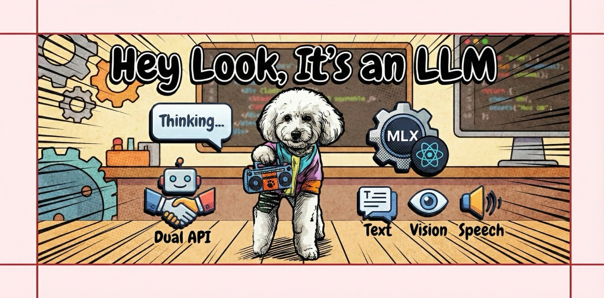

# Hey Look, It's an LLM

Last updated: 2026-08-19

<p align="center">
  <a href="assets/heylookitsanllm.jpeg">
    
  </a>
  <br>
</p>

Local multimodal LLM API server with dual OpenAI-compatible and Anthropic
Messages-style endpoints, a vanilla-JS web UI, and on-the-fly model swapping.

Built on Apple MLX for text and vision, with GGUF models served through a
managed [llama.cpp](https://github.com/ggml-org/llama.cpp) `llama-server`
subprocess -- one API, one UI, per-model engine choice.

## Features

- **Dual API**: OpenAI-compatible `/v1/chat/completions` and Anthropic
  Messages-style `/v1/messages` with typed content blocks (text, image,
  thinking, logprobs, hidden states)
- **Three providers**: MLX text + vision ([mlx-lm](https://github.com/ml-explore/mlx-lm),
  [mlx-vlm](https://github.com/Blaizzy/mlx-vlm)), GGUF via a managed
  llama-server subprocess (vision mmproj sidecars, audio input, speculative
  decoding/MTP, prefix caching), and MLX embeddings (any mlx-lm architecture)
- **Thinking blocks**: format-aware reasoning parsing driven by the model's
  own chat template (Qwen `<think>` styles, gemma channel format), with
  round-trip editing, streaming, and a per-request toggle
- **Vision and audio input**: images on both APIs and in the chat UI; audio
  clips (WAV/MP3/FLAC) on GGUF models -- MLX models reject audio with a
  clear 400
- **Logprobs and hidden states**: per-token top-K alternatives; intermediate
  layer extraction for conditioning or research
- **J-Space**: Jacobian-lens interpretability -- per-layer "silent workspace"
  tokens plus a hallucination-risk signal ([guide](docs/jspace_guide.md))
- **RLM**: recursive inference -- the model explores long contexts by writing
  Python against a sandboxed REPL ([guide](docs/rlm_guide.md),
  [advanced](docs/rlm_advanced.md))
- **Model management**: scan, import, configure, load/unload from the web UI
  or API; batch endpoint for multi-prompt workloads
- **Local-only logging**: opt-in JSONL metrics/events under `logs/`

## Things to know (heylook-specific)

- **Defaults**: port 8000 (`--port`), bound to `127.0.0.1` (`--host 0.0.0.0`
  to expose it on your network). HTTPS is not built in; put your own reverse
  proxy in front if you need it.
- **Opt-in auth, off by default**: `HEYLOOK_ADMIN_TOKEN` gates admin/destructive
  endpoints (`X-Heylook-Admin-Token` header); `HEYLOOK_API_KEY` gates inference
  (`Authorization: Bearer`; loopback exempt unless
  `HEYLOOK_API_KEY_ENFORCE_LOOPBACK=true`).
- **`models.toml` is override-only.** Anything under a `[scan].folders` watch
  folder is served automatically with defaults derived from the model's own
  files (modalities, chat template, sampling, KV-cache sizing) -- a new
  download needs no import, no edit. A `[[models]]` entry always wins as an
  explicit override; import exists for pinning entries you intend to hand-edit.
- **One model resident by default** (`max_loaded_models = 1`): LRU eviction,
  optional idle unload (`idle_unload_seconds`). Loading a model on request is
  disclosed in the UI, never confirmed away.
- **GGUF needs a llama-server binary**, built by
  `uv run scripts/build_llama.py` (`uv sync` cannot build C++). One subprocess
  per loaded model. The chat template is the one embedded in the GGUF by the
  quant publisher -- `chat_template_path` is the per-model override. An
  omitted `max_tokens` gets a 4096 default (an explicit value always wins);
  llama-server's own "unlimited" default is never passed through.
- **Telemetry is off by default** (`observability_level`, settable via
  `PUT /v1/admin/config`); raising it writes JSONL under `logs/`, local files
  only.
- **Server-side storage** (conversations, notebooks, presets, settings) is a
  single DuckDB file; `HEYLOOK_DB_PATH` relocates it, `HEYLOOK_LOGS_DIR` the
  log dir.

## Web UI

Vanilla JS frontend at `/v3` -- no bundler, no node_modules, no build step;
served directly by the backend. Conversations, notebooks, and presets are
stored server-side in DuckDB (messages as content blocks; images round-trip).

Pages: **Chat** (streaming with thinking blocks, capability-gated image/audio
attach, per-conversation system prompt + presets, honest mid-conversation
model switching), **Notebook** (base-model continuation), **Models** (scan,
import, load/unload, schema-driven per-model config editor), **Performance**,
**Token Explorer**, and **J-Space** (needs a fitted lens under
`adapters/jspace/`).

Build contract: [docs/frontend_v3_spec.md](./docs/frontend_v3_spec.md) (§4 =
the backend API contract).

## Quick Start

```bash
git clone https://github.com/fblissjr/heylookitsanllm
cd heylookitsanllm
uv sync    # one step -- full runtime + dev tooling, no extras to remember

# point it at your models: add a watch folder to models.toml ([scan].folders),
# or import explicit entries:
heylookllm import --hf-cache            # from the HuggingFace cache
heylookllm import --folder /path/to/models

heylookllm --log-level INFO             # serves API + UI on :8000
```

Then open `http://localhost:8000/v3`.

Run it as a background service with `heylookllm service install`
(`status|start|stop|restart|uninstall`; `--host 0.0.0.0` for LAN).

### Adding models

Import writes THIN `models.toml` entries -- `id`, `model_path`, `provider`,
plus anything you explicitly chose. Everything else is derived from the
model's own files at load time and never goes stale; a stored field always
wins as an override. See `models.example.toml` for the format.

Three routes: the Models page in the UI (scan, select, import), the CLI
(`heylookllm import --folder ... [--sampler balanced]`), or the admin API
(`POST /v1/admin/models/scan` then `POST /v1/admin/models/import`). The scan
understands MLX/safetensors dirs, embedding models, and GGUF dirs (mmproj
projectors and `mtp-*` drafter sidecars auto-paired).

After hand-editing `models.toml` on a running server:
`curl -X POST http://localhost:8000/v1/admin/reload`.

## API

Interactive docs at `http://localhost:8000/docs`; live schema at
`/openapi.json`. Key endpoints: `/v1/chat/completions`, `/v1/messages`,
`/v1/embeddings`, `/v1/hidden_states`, `/v1/rlm/completions`,
`/v1/batch/chat/completions`, `/v1/jspace/analyze`.

## Related apps

- [`apps/batch-labeler/`](apps/batch-labeler/) -- standalone CLI for labeling
  image directories with VLMs
- [`apps/optloop-lib/`](apps/optloop-lib/) -- library-level benchmark harness
  for mlx-lm/mlx-vlm fork experiments ([guide](docs/optloop_guide.md))

## Monitoring

With `observability_level` raised, `tail -f logs/metrics.jsonl` (per-request
metrics) or `logs/events.jsonl` (errors + model lifecycle), or point DuckDB at
the files for aggregates:
`duckdb -c "SELECT model, quantile_cont(generation_tps,0.95) FROM read_json_auto('logs/metrics.jsonl') GROUP BY model"`.

## Troubleshooting

```bash
heylookllm --log-level DEBUG
```

## License

MIT License -- see [LICENSE](LICENSE)
