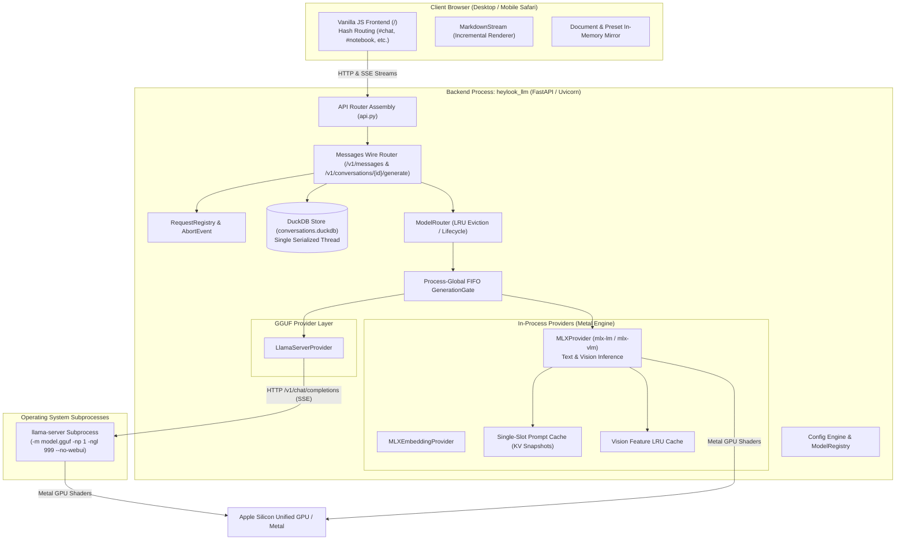

# Architecture Overview

This document details the high-level system topology, process boundaries, execution flows, and threading models across `heylookitsanllm`.

---

## 1. System Topology

`heylookitsanllm` is split into two primary components:
1. A **Python FastAPI backend** (`src/heylook_llm/`) running on Apple Silicon.
2. A **vanilla JavaScript frontend** (`frontend/`) served by the backend at `/`.

In addition, when serving GGUF models, the backend spawns and manages an external C++ binary:
3. **`llama-server` subprocess(es)** built from llama.cpp.



---

## 2. Process Boundaries & Subprocess Isolation

A foundational design decision in `heylookitsanllm` is how providers are hosted:

| Provider | Host Execution Model | Dependency Boundary | Lifecycle Model |
| :--- | :--- | :--- | :--- |
| **`mlx`** (Text/Vision) | **In-Process** | `mlx`, `mlx-lm`, `mlx-vlm` Python packages running on GPU streams | Memory-managed by MLX cache and Python GC; pinned executor threadpool |
| **`mlx_embedding`** | **UNSUPPORTED RIGHT NOW** | -- | `create_chat_completion` raises `NotImplementedError` ([`mlx_embedding_provider.py`](../../src/heylook_llm/providers/mlx_embedding_provider.py)); the provider is not wired to the generation gate. Treat every statement in this wiki about provider behaviour as covering `mlx` and `gguf` only. |
| **`gguf`** | **Out-of-Process Subprocess** | Zero MLX dependency; pure Python stdlib (`urllib`, `subprocess`, `socket`) | 1 `llama-server` process per loaded model; spawned on load, killed on unload |

### Why Out-of-Process `llama-server`?
1. **Crash Isolation**: a memory fault, invalid GGUF tensor format, or Metal shader abort inside llama.cpp crashes only the child process, leaving the FastAPI backend alive to report it. How it surfaces depends on whether headers have gone out: a **non-streaming** request raises and becomes an HTTP 500; a **streaming** one is already past its 200, so the failure arrives as an in-band SSE `error` event, never as a status code. A 503 is *not* a crash outcome -- that code belongs to the gate's backpressure contract (§3.1) and to an uninitialized database.
2. **Deterministic Cleanup & LRU**: when `ModelRouter` unloads a model (LRU eviction or idle timeout), it issues `SIGTERM` to the `llama-server` process **group**, escalating to `SIGKILL` if that is ignored, and the OS reclaims the process's memory on exit. Note the asymmetry with MLX: `MLXProvider.unload()` waits for in-flight generations *and* gate waiters (30s cap), because `_active_generations` is MLX-local. The gguf unload never waits for in-flight *requests* -- SIGTERM goes out regardless -- but it does wait for the process to exit before escalating, so it is not a bare signal either.
3. **No llama.cpp C-extension in the Python process**: nothing links llama.cpp into the backend, so there are no CFFI/pybind11 build conflicts or GIL interactions from *it*. The environment does ship other native extensions (MLX, DuckDB); the claim is scoped to llama.cpp.

---

## 3. Concurrency & Gate Invariants

### 3.1. Single-Tenant Serialized Inference
The reason in the source is **one GPU**, not memory-bandwidth economics. [`generation_gate.py`](../../src/heylook_llm/providers/common/generation_gate.py) states it: a single GPU with one loaded model and a shared KV cache means only one generation can run at a time, so concurrent requests should *queue and each complete* rather than the newest aborting the in-flight one. [`mlx_provider.py`](../../src/heylook_llm/providers/mlx_provider.py) adds the cross-model half: generation must serialize across all loaded MLX models, or two providers would run concurrent generations on the shared Metal command queue.

No throughput claim is made here, and none should be added -- read the two sources above for the design's actual premise.
- **Process-Global FIFO Generation Gate** ([`get_process_gate`](../../src/heylook_llm/providers/common/generation_gate.py)): a process-wide singleton with exactly two consumers -- [`mlx_provider.py`](../../src/heylook_llm/providers/mlx_provider.py) (through its kept-name wrapper `_get_generation_gate`) and [`llama_server_provider.py`](../../src/heylook_llm/providers/llama_server_provider.py). `mlx_embedding` is unsupported and touches none of it.
- The **first provider constructed wins**: it fixes the queue depth for the whole process, which is why that field is classified load-time-only rather than as per-model tuning. Because the gate is process-wide, `generation_queue_stats()` reports process traffic, not per-model traffic, and any "is this model busy" logic built on it is conservative across models.
- **Admission Queue**: admits waiting requests in arrival order up to `max_queue_depth` (the bound and its default live on the provider config in [`config.py`](../../src/heylook_llm/config.py)). A request arriving when the queue is saturated gets `503 Service Unavailable` via `ModelBusyError`.
- **One Active Slot (`-np 1`)**: For GGUF models, `llama-server` is spawned strictly with `-np 1`. Heylook holds the generation gate before forwarding the request, ensuring requests never silently queue in `llama-server`'s internal HTTP queue where they might exceed read timeouts.

### 3.2. Pinned Executor Pool for MLX
Generation is driven with `loop.run_in_executor`, and asyncio's **default** executor is a multi-thread pool -- so successive `next()` calls on one generator could land on different threads. MLX keeps thread-local Metal streams, and a thread that dies still holding MLX state tears that state down without the GIL, aborting the process rather than raising.
- `heylookitsanllm` therefore leases from a dedicated, non-shrinking [`_PinnedExecutorPool`](../../src/heylook_llm/streaming_utils.py) (module-level instance `_executor_pool`): one pinned thread per admitted request, kept alive for the life of the process, and *quarantined* rather than shut down if a generator wedges. Read that module for the failure it encodes.

---

## 4. Storage & Persistence: The DuckDB Model

Application state (conversations, messages, notebook cells, presets, operational settings) is persisted in a local DuckDB database at `data/conversations.duckdb`, resolved relative to the working directory and overridable with `$HEYLOOK_DB_PATH`:

- **One Connection, One Thread**: a single DuckDB connection, with **every** operation -- reads included -- running on a `ThreadPoolExecutor(max_workers=1)`. That gives strict serialization (stronger than a lock: queued operations do not pile up blocking pooled threads) and keeps DB work off asyncio's shared default executor, where model loads and generation consumption would contend with trivial reads. Each operation runs in an explicit transaction with rollback on exception.
- **Dynamic Field Allowlists**: To prevent SQL injection without heavyweight ORMs, database update routines use strict frozensets ([`UPDATABLE_CONVERSATION_FIELDS`](../../src/heylook_llm/db.py), etc.).
- **No Migration Policy**: schema changes bump `_SCHEMA_VERSION`, which **drops and recreates only the versioned tables** -- the drop list is explicit in [`db.py`](../../src/heylook_llm/db.py). `presets` and `settings` are deliberately outside it: they are versionless config promised to survive destructive operations. Migrations are explicitly avoided.
- **Authoritative Server Generation**: In chat generation (`POST /v1/conversations/{id}/generate`), the backend owns database persistence. It writes the user prompt, tracks streaming chunks, commits the assistant reply, and emits an authoritative `heylook_saved` event carrying the exact saved message IDs and timestamps.

---

## 5. Directory Structure & Key Packages

```
heylookitsanllm/
├── src/heylook_llm/             # Backend package root
│   ├── api.py                   # FastAPI app composition & middleware
│   ├── router.py                # ModelRouter: load/evict/pin, config merge at load
│   ├── schema/                  # Messages wire models + converters
│   ├── config.py                # Pydantic schemas, effect metadata, models.toml parser
│   ├── db.py                    # DuckDB persistence layer (conversations, presets)
│   ├── model_registry.py        # Resolved-path model discovery & registry merge
│   ├── model_importer.py        # Model file inspection & sidecar pairing
│   ├── request_registry.py      # Active request tracking & cancellation
│   ├── model_service.py         # models.toml read/write, materialization, scan projection
│   ├── ram_fit.py               # Model sizing vs the live Metal working set
│   ├── gguf_metadata.py         # Zero-dependency GGUF header reader
│   ├── reasoning_parser.py      # Routing parsers + the StripSpecials wrapper
│   ├── samplers.py              # The sampler resolution cascade
│   ├── observability.py         # Single JSONL ingestion path (opt-in, default off)
│   ├── toml_comments.py         # Comment-preserving models.toml writes
│   ├── auth.py                  # Optional admin-token gate ($HEYLOOK_ADMIN_TOKEN)
│   ├── providers/               # Engine provider implementations
│   │   ├── base.py              # BaseProvider, GenerationChunk, error classes
│   │   ├── mlx_provider.py      # MLX text & vision unified generation
│   │   ├── llama_server_provider.py # GGUF / llama-server subprocess manager
│   │   └── common/              # Shared gate, caches, prompt templates
│   └── *_api.py                 # Modular Starlette/FastAPI route controllers
├── frontend/                    # Vanilla JavaScript frontend (served at /)
│   ├── index.html               # Shell markup
│   ├── css/                     # Custom stylesheet system (design tokens)
│   └── js/
│       ├── app.js               # Hash router & app lifecycle coordinator
│       ├── api.js               # Fetch wrapper for /v1 endpoints
│       ├── streaming.js         # SSE parser & callback-driven stream client
│       ├── markdown-stream.js   # Linear-time incremental markdown chunker
│       ├── context-select.js    # GGUF context picker & reload trigger
│       ├── model-config.js      # Schema-driven per-model admin editor
│       ├── preset-bar.js        # Shared preset manager & prompt override guard
│       └── pages/               # Page controllers: chat, notebook, models, perf
├── scripts/                     # Developer & operational automation
│   ├── build_llama.py           # Canonical C++ builder for llama-server
│   ├── ram_report.py            # Unified RAM & Metal working set pre-flight
│   ├── gpu_wired_limit.sh       # Read/raise/persist iogpu.wired_limit_mb (set needs root)
│   ├── dev_server.sh            # Isolated test server launcher
│   └── vendor_frontend.py       # Vendored JS: --verify (offline), --check (+npm), --update
└── docs/                        # Tracked documentation and guides
    └── wiki/                    # This engineering wiki
```
