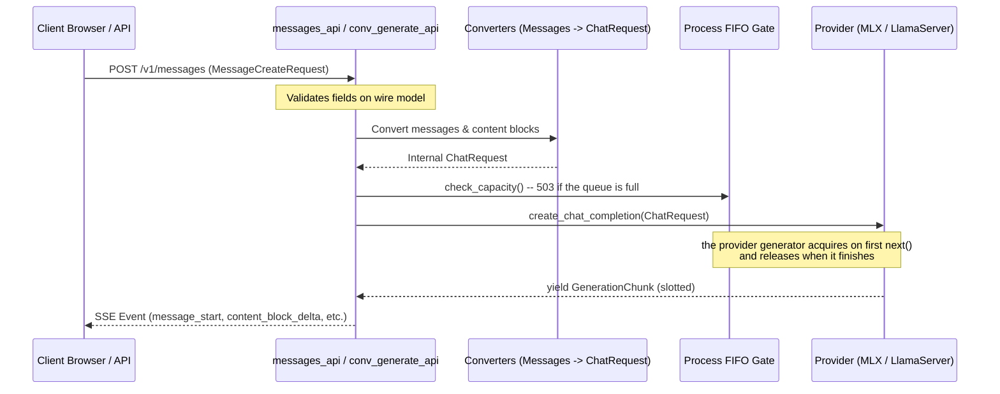

# Core Backend Architecture

The backend of `heylookitsanllm` is built with **FastAPI** and **Starlette**, packaged under [`src/heylook_llm/`](../../src/heylook_llm). It is designed around modular routers, a unified inference grammar, DuckDB persistence, and an override-only configuration engine.

---

## 1. Application Assembly & Router Topology

The entry point [`api.py`](../../src/heylook_llm/api.py) is intended as the **application assembly hub**: business logic, route handlers and data structures live in modular route modules, and a new route belongs in one of them rather than here.

**The codebase has one live exception**, worth knowing before you trust the rule: `api.py` declares `POST /v1/data/clear` inline on the app -- a destructive route that deletes all conversations, messages and notebooks. It is the only inline route in the file. `api.py`'s own module docstring still claims every route lives in a `*_api.py` router, so the docstring, the rule and the file disagree.

```
Route modules in src/heylook_llm/:
├── messages_api.py              # THE inference wire: POST /v1/messages
├── conversation_generate_api.py # Server-owned generation: POST /v1/conversations/{id}/generate
├── conversation_api.py          # Conversation & message CRUD: /v1/conversations/*
├── notebook_api.py              # Notebook documents: /v1/notebooks/*
├── preset_api.py                # Preset management: /v1/presets/*
├── model_ops_api.py             # models_router (/v1/models list) + model_ops_router (load)
├── admin_api.py                 # THREE routers, all defined here:
│                                #   admin_router        -> /v1/admin/models  (CRUD, status, fit,
│                                #                          toggle, reload, unload)
│                                #   scan_import_router  -> /v1/admin/models  (scan, import,
│                                #                          discovered, validate, samplers,
│                                #                          scan-config, bulk-default-sampler)
│                                #   admin_ops_router    -> /v1/admin         (model-options, ops)
├── config_api.py                # Operational settings: /v1/admin/config
├── monitoring_api.py            # /v1/capabilities, /v1/system/metrics,
│                                # /v1/performance/profile/{time_range}, /v1/cache/*
├── embeddings_api.py            # POST /v1/embeddings
├── hidden_states_api.py         # /v1/hidden_states, /v1/hidden_states/structured
├── requests_api.py              # Execution cancellation: DELETE /v1/requests/{id}
├── telemetry_api.py             # Frontend ingestion: /v1/telemetry/events
├── rlm.py                       # Recursive inference (POST /v1/rlm/completions)
├── frontend_static.py           # Static assets: /, /index.html, /icon.svg, /js/*, /css/*
└── openapi_doc.py               # Custom OpenAPI schema & documentation narrative

Not every route comes from a *_api.py router: `rlm.py` carries its own, `frontend_static.py`
registers the asset routes, and `api.py` declares one inline route (see above).
```

Four routers sit under a `/v1/admin*` prefix -- the three in `admin_api.py` plus the settings router in `config_api.py` -- and all four carry the admin-token dependency, as do the data-clear and cache-clear routes outside that prefix. The gate is a **no-op unless `HEYLOOK_ADMIN_TOKEN` is set to a non-empty value**; when it is, a request must present a matching `X-Heylook-Admin-Token` header or get a 401.

Model *load* is deliberately not behind it -- a generate request already loads and can evict, so the token would be gating nothing.

### Application Lifespan
The FastAPI `lifespan` handler coordinates subsystem lifecycle. Note that the `ModelRouter` is **not** built here -- `server.py` constructs it and passes it in on `app.state`. Nothing is warmed *by the lifespan*; a model named with `--model-id` is pre-warmed inside the router's own construction, before the lifespan runs.

1. **Startup**: attaches a `MemoryManager` sharing the router's lifetime, starts the resource-snapshot loop task, opens the DuckDB connection, then resolves operational settings and configures the observability spine from them (`apply_runtime_settings`). The startup telemetry record is written *after* that, so it honours the level it just resolved rather than the pre-configure default.
2. **Shutdown**: `router.unload_all()` runs **first and in its own `try`**. A gguf model's residency *is* a running `llama-server` subprocess in its own process group, which the terminal's Ctrl-C never reaches; anything still loaded at exit becomes a multi-GB orphan reparented to PID 1. Ordering it ahead of the DB close, guarded, means no later teardown failure can strand one. The database connection is closed next, then the snapshot task is cancelled.

---

## 2. The One Inference Wire: Anthropic Messages Standard

In v1.79.66, legacy OpenAI-compatible endpoints (`/v1/chat/completions`, batch completions) were completely removed. All inference in `heylookitsanllm` speaks an **Anthropic Messages-conformant wire**.

### 2.1. Dual-Route Architecture
Inference is served by two distinct routes sharing a single wire grammar:
- **`POST /v1/messages`** ([`messages_api.py`](../../src/heylook_llm/messages_api.py)): Stateless inference route conforming to Anthropic's Messages specification. Used by programmatic external clients and the Notebook frontend.
- **`POST /v1/conversations/{id}/generate`** ([`conversation_generate_api.py`](../../src/heylook_llm/conversation_generate_api.py)): State-managed generation route used by the Chat frontend. The server reads conversation history directly from DuckDB, manages database persistence during generation, and terminates the SSE stream with an authoritative `heylook_saved` event containing persisted message metadata.

### 2.2. Internal `ChatRequest` Contract
Although external requests use the Messages format (`MessageCreateRequest`), internal providers (`MLXProvider`, `LlamaServerProvider`) accept the internal [`ChatRequest`](../../src/heylook_llm/config.py):
- **Conversion Boundary**: converters translate Anthropic content blocks, media sources, and the top-level system prompt into `ChatRequest.messages`.
- **One stop-reason mapper**: providers speak OpenAI's `finish_reason` because the internal `ChatRequest` does; the rename to Anthropic's vocabulary happens in exactly one table, `converters.STOP_REASON_FROM_FINISH_REASON`. Both routes on this grammar share `StreamingEventTranslator`, so block payloads agree by construction -- but each once assigned `stop_reason` itself, and fixing one left the other emitting `"length"` for a commit. Per-path behavioral tests are structurally blind to cross-path divergence, which is why the guard asserts the shared mapper is the *only* writer rather than checking either path's output.
- **Validation Invariant**: Because external clients never directly bind `ChatRequest` as an HTTP body, **input validation and field deprecation guards must live on `MessageCreateRequest`**. A validator placed on `ChatRequest` is invisible to HTTP clients because Pydantic ignores undeclared extra fields on wire models.



---

## 3. Persistence: The DuckDB Store

Database interactions are managed by [`db.py`](../../src/heylook_llm/db.py). The database file is `data/conversations.duckdb`, resolved **relative to the working directory** and overridable with `$HEYLOOK_DB_PATH`.

### 3.1. One Connection, One Thread
`Store` holds a **single** DuckDB connection and runs **every** operation -- reads included, not just writes -- on a `ThreadPoolExecutor(max_workers=1)`:
- `max_workers=1` gives strict serialization, which is stronger than a lock: queued operations do not pile up blocking pooled threads.
- It also keeps DB work off asyncio's shared default executor, where long-running model loads and generation consumption would otherwise contend with trivial reads.
- Every *store operation* runs inside an **explicit transaction with rollback on exception**. DuckDB autocommits per statement, so without this a crash between the statements of one logical operation leaves partial state -- and an error mid-transaction would wedge the long-lived connection until `ROLLBACK`.
- **Schema work is the exception**: table creation and the version-bump drop/recreate run directly on the connection during construction, off the executor and outside that transaction wrapper. That is before any concurrency exists, but it is also the most destructive write in the file, so it is worth knowing it is unscoped.

### 3.2. Allowlist-Gated Dynamic SQL
Dynamic updates are validated against immutable frozensets declared in [`db.py`](../../src/heylook_llm/db.py) -- one per updatable row type. Any field outside its allowlist is rejected before SQL is constructed, which is how dynamic column names avoid being an injection surface without an ORM.

The conversation set is deliberately **public** while the others are private: the update route pre-filters with the same set, and until it imported the real one it carried a hand-written second copy.

### 3.3. Schema Policy: No Migrations
To maintain simplicity and prevent migration drift in a local workstation context:
- Adding a new table uses `CREATE TABLE IF NOT EXISTS`.
- Modifying existing table structures increments `_SCHEMA_VERSION`, which **drops and recreates** the versioned tables: `messages`, `media_blobs`, `conversations`, `notebooks`, `schema_meta`.
- `presets` and `settings` are deliberately **not** in that drop list. They are versionless config -- additive `CREATE TABLE`, no foreign key into versioned tables -- and are promised to survive destructive operations. A change to *their* schema needs its own explicit handling, not this hammer.

---

## 4. Configuration Engine & TOML Comment Preservation

System and model configurations are defined in [`src/heylook_llm/config.py`](../../src/heylook_llm/config.py) and stored on disk in `models.toml`.

### 4.1. Effect Classes
Every field of the **provider config classes** -- the ones in `PROVIDER_CONFIG_CLASSES` -- declares an **effect class** in its Pydantic `json_schema_extra`. The enforcing test iterates exactly that mapping, so the covered set is the MLX, MLX-embedding and GGUF config classes. **`AppConfig` is not covered and declares no effect metadata on any field.**

The classes themselves, and which field declares which, are in [`config.py`](../../src/heylook_llm/config.py) -- read them there. A roster copied into prose is the drift this repo already names: a hand-copied constant list is a defect with a delay.

What is worth carrying here is the shape and the two traps:
- **Classification is provider-aware, deliberately.** The same field name can hold a different class on different providers -- `modalities` is merely descriptive for GGUF but forces a reload on MLX, because there it feeds `effective_loader` and so decides which engine holds the weights.
- **A model's `id` carries no effect metadata at all.** It is a bare annotation on `ModelConfig`, not a field of any provider config class; `model_path` is the one that declares identity.

The reload check set, model import allowlists, and the admin options API (`/v1/admin/model-options`) all derive from these annotations rather than from a second hand-written list.

### 4.2. Lossless TOML Comment Preservation
`models.toml` is frequently hand-edited with developer notes and performance findings. When the backend or UI writes to `models.toml` (e.g. updating a setting via admin API), [`toml_comments.py`](../../src/heylook_llm/toml_comments.py) preserves existing comments:
- **Strict Read-Only tomlkit**: `tomlkit` is used *only* to extract comment AST positions; it is never used for serializing changes (mutating parsed tables in `tomlkit` corrupts array-of-table structures into inline arrays).
- **Authoritative `tomli_w`**: `tomli_w` writes the clean, normalized TOML values.
- **Line-Injection Merge**: comments are re-injected as lines into the fresh render, each carried only while its **anchor** is unchanged, so a note can never outlive what it describes. The rule is stricter than "the comment on the changed key is dropped":
  - an inline comment on a top-level key, or a full-line block above one, carries only if that key's *rendered value* is identical;
  - **every** comment inside a `[[models]]` entry carries only if that whole model renders byte-identically through `tomli_w` (normalized, so the old file's hand-formatting pins nothing) -- change one field and that entry's comments all go;
  - a block at the end of a model's section sits visually above the *next* model's header, so it additionally requires that following model to be unchanged and still immediately next.
- **Fails safe, never blocks**: on any parse failure, missing anchor, or merged text that no longer parses to exactly the fresh render's values, the comment-less render is written instead. Doubt degrades to a plain write, never to a refusal.
- **The consequence worth holding**: a comment on the value you are *patching* is deliberately dropped. Provenance for a value you are changing belongs in `CLAUDE.md` or `internal/`, not next to the value.

---

## 5. Model Registry & Load-Time Discovery

Model availability is governed by [`model_registry.py`](../../src/heylook_llm/model_registry.py).

### 5.1. The Override-Only Philosophy
`models.toml` is strictly an override file:
- Scanning happens at **load time** (so both startup and every config reload) and again periodically on the memory manager's tick. The cadence is `[scan].scan_interval_seconds` in [`config.py`](../../src/heylook_llm/config.py); setting it to `0` disables the periodic rescan **and the load-time scan too**, because switching scanning off must not silently start serving everything under the folders instead.
- Folders are not the only trigger: `[scan].watch_hf_cache` runs discovery over the HuggingFace cache with no folders configured at all.
- Discovered models not listed in `models.toml` are served with automatically derived parameters. A new download needs no import, no symlink and no edit.
- The merge **never writes `models.toml`**. A `[[models]]` entry is served exactly as written and always wins; discovery can only ADD.
- Discovery is **best-effort**: a failing scan is logged and dropped, never fatal. An empty result is the correct answer for "no `[scan]` section", "scanning is off" and "the scan failed" alike -- all three mean `models.toml` stands alone.
- Admin edits **materialize** an entry on write (`update_config`, `toggle_enabled`, `bulk_set_default_sampler`), because editing *is* the override. Reads never do, or browsing the models page would grow the file. `remove_config` deliberately does not materialize: the next scan would serve the model back, and a "removed" model that reappears is worse than a clear refusal.

### 5.2. Resolved Path Matching (`path_identity`)
Models are deduplicated and merged based on **`path_identity(path)`**, which executes `Path(path).expanduser().resolve()`.
- Matching on model IDs is strictly forbidden: IDs derive from directory names, which break when directories are symlinked across `modelzoo/<vendor>/` aliases.
- **The Explicit Entry Gotcha**: if an entry already names a model's resolved path, `merge_discovered()` **skips** that discovered model, so nothing re-derives for it ever again. **An explicit entry receives NONE of discovery's derived fields.** Adding one field means hand-writing every *other* field that model needs -- `mmproj_path`, `draft_model_path` and the rest. This has bitten in both directions: a thin materialized entry once cost a vision model its `mmproj_path`, so the next spawn had no `--mmproj` with the projector sitting unreferenced beside the weights; and enabling `spec_type` on a text model required writing `draft_model_path` longhand, because the drafter the importer would have auto-paired is not contributed to an entry that already exists.

  Before adding a field to an entry, check what discovery *was* giving that model -- `merge_discovered(data, discover(data))` -- and carry it forward, or the edit is a silent capability removal.

---

## 6. Request Registry & Cooperative Cancellation

Generation requests are tracked by [`request_registry.py`](../../src/heylook_llm/request_registry.py).

### 6.1. Request ID Tracking
Every request receives an ID, either from the client via the `X-Request-ID` header or generated by the server. A client-supplied id is honoured **verbatim** -- that is the whole point, since the client must be able to name the request in a later `DELETE`, and a server-rewritten id would not match.

Ids are **validated, not sanitized**: a header value is accepted only if it matches the id pattern in [`request_registry.py`](../../src/heylook_llm/request_registry.py), and is otherwise discarded in favour of a generated one. A charset and a length bound exist because these values reach logs and JSONL, where a newline would forge a log line -- and the match is a `fullmatch` for that reason. The cancel route imports the same validator, so the two ends cannot disagree about what a valid id is.

The registry maps one id to a **set** of abort events, not a single one: two live requests may legitimately share a client-supplied id, and a single-slot map would let the second orphan the first.

### 6.2. Cooperative `AbortEvent`
Each running generation is associated with an `AbortEvent`:
- **Streaming requests do get disconnect polling**, and it is on by default: the streaming wrapper in [`streaming_utils.py`](../../src/heylook_llm/streaming_utils.py) checks whether the peer has gone while awaiting the next chunk, and sets the abort event if so.
- **The conversation-generate route deliberately opts out** of that (`abort_on_disconnect=False`). Its response is a *subscriber* to a server-owned run: the generation finishes and commits whether or not the browser is still listening, which is what makes a dropped phone connection lose the view rather than the answer.
- **Non-streaming requests cannot notice a departed client at all** -- nothing is written until the run finishes. An abandoned one used to run to completion and block everything queued behind it.
- `DELETE /v1/requests/{request_id}` sets that run's `AbortEvent` from outside it. The plumbing already existed; what was missing was a way to *name* a running request. It makes a run **stoppable, not self-stopping** -- a client that hangs up without calling it still leaves it running. The explicit endpoint is the deliberate half: it cannot mistake a proxy hiccup for a departed client and kill a live generation.
- A streaming body outlives its route function, so a request is registered by **wrapping the generator**, never by a `with` block around the return.
- When `AbortEvent.is_set()` fires:
  - In `MLXProvider`: Generation stops at the next token boundary.
  - In `LlamaServerProvider`: The HTTP response stream to `llama-server` is immediately closed, freeing the slot in `llama-server`.
