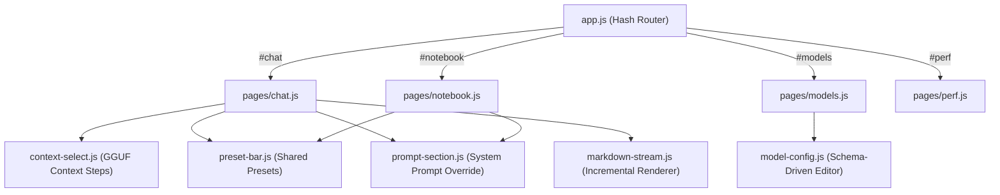
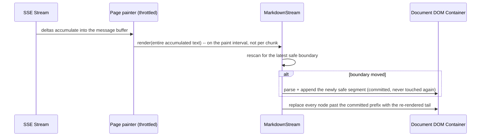

# Core Frontend Architecture

The user interface of `heylookitsanllm` is located in [`frontend/`](../../frontend). It is served at `/` by the FastAPI backend ([`frontend_static.py`](../../src/heylook_llm/frontend_static.py)).

The frontend is built on a **zero-build, vanilla JavaScript architecture** with no bundlers, transpilers, or virtual DOMs.

---

## 1. Architectural Philosophy: Zero-Build & Strict Routing

### 1.1. No Build Step & Vendored Dependencies
- The app runs directly in any modern browser without Vite, Webpack, or npm dependencies.
- External libraries are strictly limited to two: **`marked`** (markdown parsing) and **`DOMPurify`** (HTML sanitization), committed in [`frontend/js/vendor/`](../../frontend/js/vendor).
- **Version pinning, not integrity hashing.** `js/vendor/vendor.json` records a `version`, `source`, `dest` and `banner_re` per package -- **no digest**. The pre-commit hook runs [`scripts/vendor_frontend.py --verify --staged`](../../scripts/vendor_frontend.py) offline, and `--verify` reads the head of each file and regex-matches the **version banner** against the manifest. `--staged` reads the staged blobs rather than the working tree, so it checks the bytes actually being committed -- but a byte-edited library whose banner still reads the pinned version passes. Treat this as a pin, not as tamper detection.
- `--check` additionally reports what npm has published, which is the only thing that will tell you these libraries have moved: they have no lockfile entry. `marked` was a major version behind before its last bump; DOMPurify was a minor.

### 1.2. Hash Routing & The No-Catch-All Rule
Navigation occurs exclusively via the URL hash. Every link the app builds is of the form `#/chat`, `#/notebook`, `#/models`, `#/perf` (the router tolerates the slashless spelling, but never emits it):
- **Why No SPA Fallback?**: The backend intentionally does *not* provide a fallback route (e.g. `/{rest:path}` serving `index.html`). A catch-all destroys 404 for mistyped API routes -- a GET-only SPA fallback answers a typo'd path with 200 and a web page, and a **POST** to that same catch-all answers 405 rather than 404. The repo's contract test pins both halves.
- **The Starlette 405 Trap**: When Starlette encounters a path catch-all matching everything, `redirect_slashes` logic fails, turning trailing slash mismatches (e.g. `POST /v1/messages/`) into **405 Method Not Allowed** instead of 307 redirects.
- **Explicit Static Mounts**: [`frontend_static.py`](../../src/heylook_llm/frontend_static.py) registers the tree's real shape and nothing else -- `/`, `/index.html`, `/icon.svg`, `/js/{rest:path}`, `/css/{rest:path}` -- each `GET`/`HEAD` only. Unknown paths 404 on every method, `/v3` and `/v2` get their gone-answer for free, and `frontend/DESIGN.md` is not served at the web root. **A new top-level asset needs a route added there.**
- **Two consequences of the handlers being sync** (and therefore running on the threadpool): the gzip response cache must not be iterated while it is mutated -- doing so raised `dictionary changed size` and turned a static asset into a 500 under concurrent cold load -- and `Path.resolve()` raises `ValueError` on a NUL byte *before* `is_file()` can swallow it, so `_serve` catches it. `GET /%00` was a 500 until it did.

---

## 2. Page Hierarchy & Lifecycles

The application is structured around four primary pages created via [`createPage`](../../frontend/js/page.js):

| Page | Controller | Primary Role & API Grammar |
| :--- | :--- | :--- |
| **Chat** | [`chat.js`](../../frontend/js/pages/chat.js) | Full multi-turn conversation UI, system prompt editor, preset bar, attachments, thinking toggle, and model selection. Drives `POST /v1/conversations/{id}/generate`. |
| **Notebook** | [`notebook.js`](../../frontend/js/pages/notebook.js) | A single continuous text document per notebook -- one textarea, a Generate button that **continues writing** into it, its own system prompt and model select, and a notebook list. Stopping keeps the partial text. Drives stateless `POST /v1/messages`. There is no branching or side-by-side comparison. |
| **Models** | [`models.js`](../../frontend/js/pages/models.js) | Registry browser with residency ("Loaded") state, folder scanning (one-off scan or watched folders, optionally including the HuggingFace cache), import of scan results that are not already served (a *discovered* model -- one already served from a watch folder with no `models.toml` entry -- is precisely the case Import is not offered for), per-model **Configure** via the schema-driven editor, and a danger zone. |
| **Perf** | [`perf.js`](../../frontend/js/pages/perf.js) | Titled "Performance", with **two** sections: **System** (RAM, CPU, currently loaded models) and **Profile** (a timing breakdown by operation, recent trends by hour, and token-weighted speculative-decode draft acceptance -- the last column appearing only when there is draft data). A Refresh control and a set of time ranges sit alongside. |

### 2.1. Store Mirroring & Dual Invalidation
The frontend UI acts as an **in-memory mirror of the DuckDB database**:
- The UI fetches document state on selection.
- **Strict Invalidation Points**: state is refetched only on (1) document selection change, and (2) resume from background. Re-clicking the already-active document does not refetch -- with one caveat in chat, where the guard also requires messages to be loaded, so an active conversation holding none will still fetch.

### 2.2. Mobile Safari Backgrounding & Teardown Flushes
iOS Safari brings a backgrounded tab back with the heap it had, and every write the page makes is **whole-value from that mirror** (prompt keystroke PUT, params PUT, preset Save snapshot) -- so a stale mirror re-plays old state over newer edits. That is why resume is an invalidation point at all.

- The lifecycle edges are `createPage`'s `ctx.onHide` / `ctx.onResume`, each of which binds **both** event spellings. Never hand-wire `visibilitychange` / `pagehide` / `pageshow` in a page.
- **Every debounced writer owns its hide flush** the way it owns its teardown flush (`prompt-section`, `bindDocumentParams` via its `onHide` argument, notebook's `scheduleSave`). Leaving it to the consumer to remember is how one shipped without.
- Hide flushes send with `keepalive` **and are dispatched ahead of the PUT chain** -- a request queued behind an in-flight PUT is never sent if the page unloads.
- Resume fetches the conversation body **only when the list's `updated_at` moved**, and commits the new stamp only *after* everything it covers is adopted; otherwise one failed fetch becomes a permanent "unchanged", since nothing else ever refetches the active conversation. It never touches a live stream's rows, the prompt while its box is being typed in, or the sidebar during a rename.

---

## 3. The Preset & Override-Box System

Presets in `heylookitsanllm` ([`preset-bar.js`](../../frontend/js/preset-bar.js)) manage bundled system prompts and sampling hyperparameters.

### 3.1. The Override-Box Rule
- A preset can define both sampler parameters and an optional system prompt.
- **Empty Means Unclaimed**: An empty prompt in a preset **never blanks the active document prompt**. It indicates that the preset makes no claim on the prompt, leaving the document's existing prompt intact.

### 3.2. Loss Prevention: `wouldOverwritePresetPrompt`
Both directions are armed, but they are not symmetric. **Apply** overwrites the *document* and is recoverable -- re-apply the preset. **Save** overwrites the *stored preset* with an UPDATE that keeps no history, so Save is the one where loss is real. It was the bare action, and the select **used to pre-fill** the save-as name box, so merely picking a preset to look at it armed that preset as Save's target; one click wrote a document's prompt over a long stored one. That pre-fill has since been removed -- the name box is created empty, with a placeholder only.

[`wouldOverwritePresetPrompt`](../../frontend/js/preset-bar.js) is an **ordered** set of questions, and the order is load-bearing:
1. No stored prompt on the target -- **nothing to lose**, do not arm.
2. Incoming prompt is identical to the stored one -- **no change**, do not arm.
3. Incoming prompt is **empty**: **always arm**, even in the iterate loop below. A null write leaves an override-box preset present but inert, which surfaces later as "my preset disappeared".
4. Otherwise: arm only if the document is **not** already running that preset. A save back onto the preset you are running is the apply/edit/save-back **iterate loop**, and charging it a confirmation would train exactly the click-through the guard exists to prevent.

**An arm is a promise about one action**, and that is enforced in the primitive rather than in consumer wiring. `armedConfirm` takes a `target()` describing destination, payload **and the stored value about to be destroyed**, captures it at arm time, and re-reads it on the confirming click -- re-arming instead of firing if any of the three moved. Including the stored value means a refresh landing between arm and confirm voids the arm. It cannot live in the bar: Save's payload is the *document's* prompt, edited in a different drawer section the bar gets no events from, so "arm, clear the prompt box, confirm" would blank a preset straight past the blanking check.

`disarm()` remains for **visible honesty** -- a button still reading "Overwrite prompt?" while aimed elsewhere is a lie even once clicking it is safe. The **select** is the only control that re-aims, and it disarms all three buttons. The name box re-aims nothing and disarms nothing. (A stale comment in `preset-bar.js` still claims the name box moves Save alone; the file's own header contradicts it.)

Enter in the name box goes straight to **Save as new**, which is correct: the rule against a second entry point past an arm exists because that is the same hole with a keyboard on it, and Save as new has no arm to get past -- it cannot overwrite anything. Update, which can, is reachable only by its own button.

There is a **second guard** past the arm: Update re-fetches first and then refuses outright if the stored prompt moved since the preview was painted, telling you to look again and press Update once more. That is what makes "you overwrite what the preview showed you" actually true rather than merely likely.

The reason that misclick was possible at all is structural: the drawer renders the preset section directly above the per-document prompt box, which shows the **document's** prompt whatever the select says, so every preset looked like it held the same text. The section now carries a read-only preview of the *selected preset's own* prompt, and the document's box names its owner.

---

## 4. Streaming Render Engine: `MarkdownStream`

Streaming long model responses with markdown and code blocks historically suffered from performance degradation.

### 4.1. The Superlinear Parsing Problem
In naive implementations, each incoming SSE token re-renders the accumulated text through `marked.parse()` and `DOMPurify.sanitize()` into `innerHTML`.
- `marked`'s parse is **superlinear in document length** -- doubling the length costs appreciably more than double, measured on a non-repeating prose/list/code document. So per-frame cost grew faster than the response did, and past a few tens of KB a single parse alone blew the frame budget *before* DOMPurify, the DOM rebuild and layout were counted. The measurement and its threshold live in the module header of [`markdown-stream.js`](../../frontend/js/markdown-stream.js). On a phone this reads as a saturated main thread for the length of a long generation -- heat and battery -- and **no check that renders a finished document can see it**.

### 4.2. Safe Boundary Chunking
[`markdown-stream.js`](../../frontend/js/markdown-stream.js) solves this through incremental boundary-based rendering:
A boundary `b` is safe only if re-parsing `[0,b)` and `[b,end)` separately yields the same HTML as parsing the whole -- i.e. no markdown construct can span it. `isHardBlockStart` requires a line that is **after a blank line** and:
- **not indented** (an indented code block, or a continuation of a list item above, spans the split);
- **not a list marker** (a marker after a blank line continues the list above as one loose list; split, it renders as two);
- **not a `>`** (same shape, for block quotes).

Fence state is tracked separately, so a cut can never land inside a fenced code block.

Two constructs **disable splitting for the whole message**, because they reach forward arbitrarily far past the only thing this scanner treats as a block break:
- **link-reference and GFM footnote definitions** (`[label]:`), which text far below can use;
- **CommonMark HTML blocks of types 1-5** (`<pre>`/`<script>`/`<style>`/`<textarea>`, `<!--`, `<?`, `<!LETTER`, `<![CDATA[`) -- these end on a closing condition, *not* on a blank line. Type 6 (`
` and friends) does end at a blank line and is deliberately excluded. Treating them as unsafe rather than tracking them open-to-close is the conservative half of the choice: the cost is that one message loses incremental rendering.

Given a safe boundary:
1. **One-Time Parse**: content preceding the boundary is parsed once, converted to permanent DOM nodes, and appended. Those nodes are never touched again, so the committed part of the message is never re-laid-out either.
2. **Tail Re-render**: only the uncommitted tail is re-rendered on each paint. Cost is bounded by the largest single block (one paragraph, one table, one fenced code block), not by the response.

The boundary rule is a **property, not a set of examples**: `tests/e2e/render.mjs` grows generated documents one chunk at a time and diffs against a whole-document render -- the same technique, and the same reason, as the backend's `TestParserInvariants`.

Note the interface: `render()` takes the **whole accumulated message**, not a chunk, and is driven by the page's paint throttle rather than by delta arrival. The tail is not one node -- each paint drops every node past the committed prefix and appends the freshly rendered ones.

### 4.3. Scroll-Follow Geometry Invariants
To maintain smooth auto-scrolling during high-speed token generation:
- Scroll offsets are calculated at the **top of the paint cycle, before DOM mutations**.
- Measuring before DOM mutation hits browser layout caches without forcing synchronous reflows.
- `content-visibility: auto` was **removed**, and not because of WebKit. It was in the original scaffold as a generic "make long lists fast" pattern, never a response to a measured problem. A skipped row reports its `contain-intrinsic-size` estimate instead of its real height until the engine lazily decides it is relevant, so `scrollHeight` lurches by thousands of pixels and **the engine moves `scrollTop` on its own** (clamping, then scroll anchoring). Every scroll decision in `chat.js` derives from those two values, so all of them were poisoned. It was measured **on Chrome** -- this is not a WebKit quirk. The reproduction and its figures are in the comment at the removal site in [`app.css`](../../frontend/css/app.css). The layout it saved was one-time and desktop-only.

---

## 5. Security: HTML Entity & Scheme Sanitization

URL schemes are checked **at the renderer**, in [`markdown.js`](../../frontend/js/markdown.js), and this is the **primary** guard rather than a backstop. `marked` does not filter schemes -- verified on 18.0.11, it emits `<a href="javascript:...">` for four different markdown spellings (inline link, image, autolink, reference link) -- so DOMPurify was for a time the only thing standing between the model's output and an executable href.

**Two separate allowlists**, both narrower than a single combined list would be:

| Context | Allowed schemes |
| :--- | :--- |
| Links (`SAFE_LINK_SCHEMES`) | `http:`, `https:`, `mailto:`, `tel:` |
| Images (`SAFE_IMAGE_SCHEMES`) | `http:`, `https:` |

A URL with **no** scheme is relative or a bare fragment and is accepted. Anything else is refused.

- **Entity decoding comes first, and that is the whole correctness argument.** The browser resolves the *decoded* attribute, so a check against the raw text checks a different string. An earlier version tested for entities only in the part *before* a literal colon, and so missed the case where the colon **itself** is an entity: `javascript&colon;alert(1)` has no literal colon at all, took the "no colon, therefore relative" early return, and was emitted verbatim -- the HTML parser then supplied the colon. Verified in real Chrome by review. **DOMPurify caught it**, which is exactly what a second layer is for; the problem was that the primary guard claimed to be primary and was not. Decoding uses a detached `<textarea>` (RCDATA content model: assigning `innerHTML` parses entities and executes nothing) and decodes **exactly once**, matching the HTML parser -- so `&amp;#58;` correctly stays the literal text `&#58;` and reads as relative.
- Any check on this must assert on **the protocol the browser resolves**, never on the rendered HTML string: a regex for `javascript:` passes on `href="javascript&colon;..."`, which is how one such check was vacuous for precisely the vectors it was added for.
- A renderer override returning `false` falls back to marked's own implementation; returning `''` does **not** (it silently drops the content). So the accept path is the one a wrong answer breaks quietly.
- DOMPurify is now genuinely the second layer rather than the only one.
