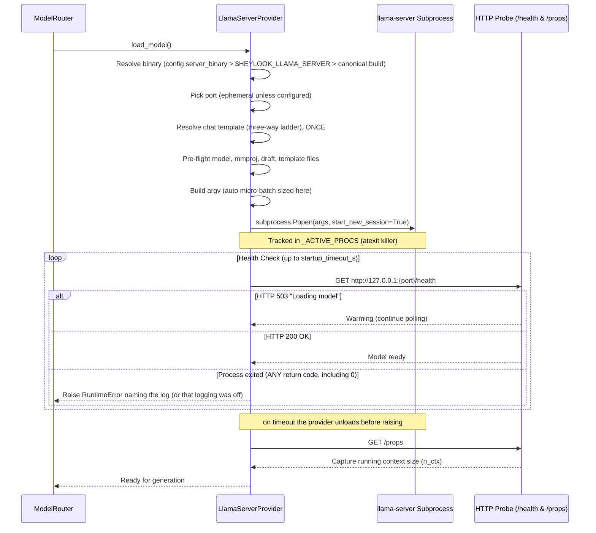
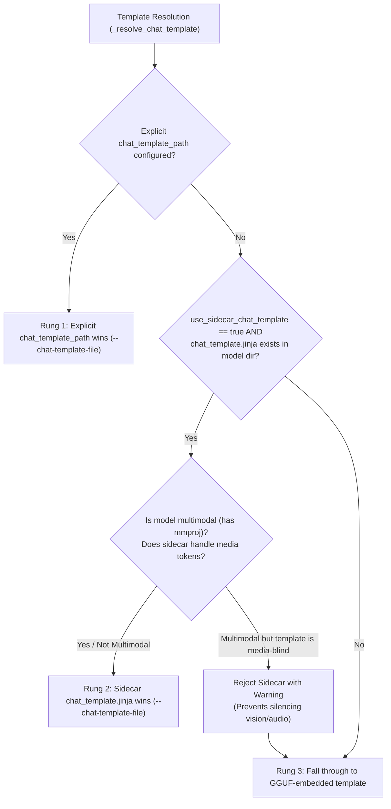
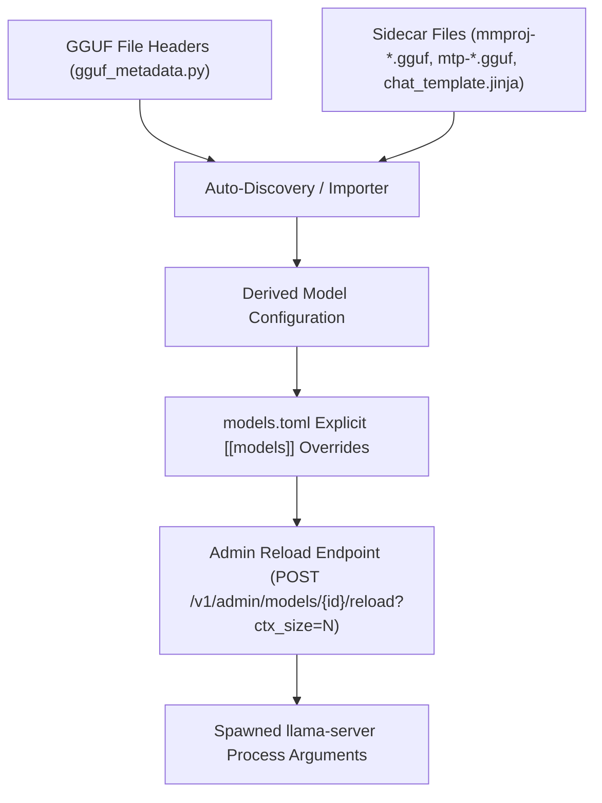

# Llama-Server & GGUF Deep Dive: Build, Spawn & Parameter Mechanics

This document is an exhaustive engineering reference for the **GGUF provider (`LlamaServerProvider`)** in `heylookitsanllm`. It details how `llama-server` is built from C++ source on macOS, how the backend manages the subprocess lifecycle, the exact CLI parameters sent and why, and how every configuration setting resolves per model.

---

## 1. Architectural Overview & Rationale

`heylookitsanllm` supports quantized GGUF models alongside its native Apple MLX models. Rather than linking against `llama.cpp` using Python C-extensions (which introduce GIL contention, thread crashes, and packaging hurdles), `heylookitsanllm` runs **one dedicated `llama-server` subprocess per loaded GGUF model**.

### Key Architectural Invariants
1. **Subprocess Isolation**: If `llama-server` experiences a Metal shader fault, out-of-memory error, or crash, the Python FastAPI backend remains healthy.
2. **Deterministic Cleanup**: "Loaded" means a running subprocess. Evicting a model via LRU or idle timeout simply issues `SIGTERM` to the process group, guaranteeing that 100% of GPU/unified memory is instantly returned to macOS.
3. **Pure Python Standard Library**: [`llama_server_provider.py`](../../src/heylook_llm/providers/llama_server_provider.py) has zero dependencies on MLX, PyTorch, or external HTTP libraries—it uses Python stdlib (`subprocess`, `urllib`, `socket`, `json`, `signal`).
4. **Single Inference Wire**: The provider translates between internal `ChatRequest` structures and `llama-server`'s `/v1/chat/completions` endpoint, streaming SSE frames back as slotted [`GenerationChunk`](../../src/heylook_llm/providers/base.py) objects.

---

## 2. Building llama-server: `scripts/build_llama.py`

Because `llama.cpp` is a C++ project, standard Python dependency tools (`uv sync`, `pip`) cannot compile it. The project provides an automated, hardened build script: [`scripts/build_llama.py`](../../scripts/build_llama.py).

### 2.1. Checkout & Workspace Rules
- **Clone Location**: Kept strictly **outside the repository**, in a fixed directory under the user's home (`.heylook/llama.cpp`); `--dir` or `$HEYLOOK_LLAMA_CPP_DIR` relocate it, in that precedence order. This guarantees multi-gigabyte build trees and C++ dependencies are never committed, packaged into wheels, or mixed with git history.
- **Blobless Clones**: Cloned using `git clone --filter=blob:none`, keeping disk footprints minimal while allowing any commit, tag, or branch to be checked out.
- **Release Versioning**: `llama.cpp` does not use semantic versioning; upstream tags every merge to `master` as `b<N>` (e.g. `b10814`). `build_llama.py` queries `git ls-remote` and builds the newest `b<N>` tag by default.
- **Unshallowing Repair**: `llama.cpp` computes its version number via `git rev-list --count HEAD`. If a checkout was shallow, the binary brands itself with an incorrect build number (e.g., "build 151" instead of "b10472"). `build_llama.py` detects shallow repositories and runs `fetch --unshallow` before compiling.
- **Remote-Tracking Branch Resolution**: When building `--rev master`, `build_llama.py` detaches onto `origin/master`, avoiding the common trap where local `master` remains stale because `git fetch` does not advance local branches.

### 2.2. CMake Flags & Engineering Rationale
The governing invariant for Apple Silicon builds is: **arithmetic executes inside Metal GPU shaders; CPU-side optimizations affect only the glue (tokenization, sampling, HTTP) and offer negligible throughput gains.**

| CMake Flag | Value | Architectural Rationale |
| :--- | :--- | :--- |
| `GGML_METAL` | `ON` | Enables the Metal backend -- the flag the rest of this table's reasoning rests on. |
| `GGML_METAL_EMBED_LIBRARY` | `ON` | Embeds the compiled `.metallib` shader archive directly inside the binary. The resulting binary is portable across filesystem paths without needing loose shader files. |
| `BUILD_SHARED_LIBS` | `OFF` | Produces a single, self-contained static binary suitable for subprocess spawning. |
| `GGML_NATIVE` | `ON` | Passes `-mcpu=native` to Clang, tuning instructions for the specific Apple Silicon host machine (M1/M2/M3/M4). |
| `GGML_ACCELERATE`, `GGML_BLAS`, `GGML_BLAS_VENDOR` | `ON`, `ON`, `Apple` | Uses Apple's Accelerate framework for hardware BLAS matrix operations on CPU. |
| `GGML_CCACHE` | `ON` | Enables compiler caching; subsequent builds after tag bumps complete in seconds. |
| `LLAMA_BUILD_SERVER`, `LLAMA_BUILD_TOOLS` | `ON`, `ON` | `llama-server` lives under `tools/`, so both are needed. `LLAMA_BUILD_EXAMPLES` and `LLAMA_BUILD_TESTS` are `OFF`, and `CMAKE_BUILD_TYPE` is `Release`. |
| `LLAMA_BUILD_UI` | `OFF` | Skips downloading embedded web UI assets from remote network buckets. |
| `GGML_LTO` | `OFF` | Whole-program Link Time Optimization (LTO) only optimizes CPU glue, adds several minutes to linking, and breaks `ccache`. Upstream disables LTO across all platforms. (Opt-in via `--lto`). |
| `GGML_OPENMP` | `OFF` | Without OpenMP, `ggml` takes the `#else` branch of the same graph-compute entry point and uses its own threadpool -- same work partition, same affinity and priority handling. This is a choice of thread runtime, not threading versus none. macOS ships no `libomp`, so `OFF` is already what every upstream mac binary runs. (Opt-in via `--openmp`.) |

#### Defusing the Upstream `--openmp` Trap
Upstream `ggml` only *warns* when OpenMP is missing and quietly links the default threadpool build anyway, so `-DGGML_OPENMP=ON` can produce a binary identical to a non-OpenMP one while the **requested** cache variable still reads `ON`. The cache keeps the request and the resolution as separate entries, and it is the resolved one that tells the truth.

Both defences below apply **only when you pass `--openmp`** -- the default build is OFF and is not refused:
- `build_llama.py` spells out the exact AppleClang include and library paths for Homebrew `libomp`, because requesting OpenMP alone does not find it.
- After configuration it reads the **resolved** OpenMP variable out of `CMakeCache.txt` and **refuses to build** if it came back off. The manifest records that resolved value too, for the same reason.

#### Why `GGML_METAL_NDEBUG` is Intentionally NOT Set
Setting `GGML_METAL_NDEBUG` compiles out load-time diagnostics, including the critical Metal warning: *"allocated size is greater than recommended max working set size"*. That warning is the ceiling which actually refuses loads on a big-unified-memory Mac, so retaining it is essential for diagnosing memory refusals. There is no throughput to gain by silencing it and real diagnostics to lose.

#### `CMakeCache.txt` Auto-Heal on Stale System Packages
CMake caches `find_package` results as static filepaths. When Homebrew upgrades a dependency (e.g. OpenSSL 3.6.3 to 3.6.4), CMake's cache contains dangling paths. `build_llama.py` catches configure failures on reused build trees, automatically drops `CMakeCache.txt`, and retries configuration cleanly.

### 2.3. Build Manifest & Stamp Verification
The script builds two targets (`llama-server` and `llama-bench`). Afterwards it writes a `heylook-build.json` manifest into the build directory, **then** runs `llama-server --version` and verifies the reported build number and Git SHA against the checked-out source. That order is deliberate and commented as such: the manifest must describe the binary that exists even when the stamp check refuses it, or `--status` starts lying.

The manifest records the requested `cmake_args` alongside an `effective` block of **resolved** values -- which is the point of it. Requested args are a statement of intent and CMake can silently downgrade one; the manifest has to describe the binary, not the wish. Shape:
```json
{
  "rev": "<build tag>",
  "sha": "<commit sha>",
  "targets": [...],
  "cmake_args": [...],
  "effective": {"GGML_OPENMP_ENABLED": "OFF", "GGML_LTO": "OFF", ...},
  "binary": "<home>/.heylook/llama.cpp/build/bin/llama-server",
  "sha256": "<binary digest>",
  "version": "<the --version line>",
  "built_at": "<timestamp>"
}
```

---

## 3. How Heylook Spawns llama-server (`llama_server_provider.py`)

When a model is requested, [`LlamaServerProvider.load_model()`](../../src/heylook_llm/providers/llama_server_provider.py) initializes and monitors the subprocess.



### 3.1. Binary Resolution Order & Shadow Warnings
[`_resolve_binary()`](../../src/heylook_llm/providers/llama_server_provider.py) applies a strict lookup hierarchy:
1. `config["server_binary"]` (explicit in `models.toml`)
2. `$HEYLOOK_LLAMA_SERVER` environment variable
3. **Canonical Build** (`LlamaServerProvider.DEFAULT_BUILD`): `.heylook/llama.cpp/build/bin/llama-server` under the user's home, built by `scripts/build_llama.py`. If none of the three yields a file, load fails loudly.

**Shadow Warning**: If an environment variable or `models.toml` override is used while a canonical build exists, the backend emits a loud warning on every spawn, preventing stale development binaries from silently shadowing fresh canonical builds.

### 3.2. Subprocess Lifecycle & Process Group Isolation
- **`start_new_session=True`**: `llama-server` is spawned in its own process **group**, so unload can signal the whole process tree rather than just the top process.
- **Orphan Prevention (`_ACTIVE_PROCS`)**: When running in an isolated process group, terminal `Ctrl-C` signals are only sent to the foreground group (FastAPI). To prevent orphaned background `llama-server` instances, all spawned processes register in module-level `_ACTIVE_PROCS`. An `atexit` hook iterates through the set and terminates remaining process groups with `SIGTERM`.
- **Ephemeral Port Allocation (`_free_port()`)**: Binds a socket to `127.0.0.1:0` to obtain an available port, avoiding hardcoded port collisions.
- **Log Management**: `llama-server` opens **no files of its own** under heylook's argv. Everything file-shaped in it is opt-in and heylook passes none of it: `--log-file`, `--log-prompts-dir` (prompt TEXT) and `--slot-save-path` (KV cache to disk). Its prompt cache (`-cram`) is RAM-only; there is no disk path for it.

  "Under heylook's argv" is doing real work in that sentence, and there are exactly two ways around it, both handled below rather than assumed away: `extra_args` (**refused** -- `GGUFModelConfig.DISK_WRITING_FLAGS`) and llama.cpp's own `config.ini` (**reported**, because it cannot be overridden). Subject to those, the only reason anything lands on disk is heylook redirecting the child's merged stdout/stderr, controlled by `observability_level`:
  - `observability_level == "off"` (default): Output redirects to `subprocess.DEVNULL`. Nothing exists anywhere.
  - `observability_level > "off"`: Logs stream to `logs/llama_server_{safe_model_id}.log`.

  Two properties of that file worth knowing before raising the level: it is opened **append**, and it is **not rotated** -- `observability.rotate_streams` covers `metrics.jsonl` and `events.jsonl` only, so this one grows unbounded and retention never prunes it.

  What reaches it: at llama.cpp's default verbosity threshold (`LOG_LEVEL_INFO`) the stream carries load-time model/Metal info, per-slot lifecycle, per-request timings and the per-request **draft-acceptance** line, but no prompt or response text -- request bodies are `SRV_DBG` (verbosity 5) and slot internals are `SLT_TRC` (4), and heylook never passes `-lv`.
- **Pre-Flight File Checks**: before spawning, `load_model()` stats `model_path`, `mmproj_path` and `draft_model_path` and names the offending **field** if one is missing. This happens in `load_model`, not in `_build_args` (which stays pure so the argv drift test can call it with paths that do not exist), and it happens *before* argv is built, because the auto micro-batch sizes the model's files and a missing file must fail with the message that names the field rather than inside sizing.

  It matters because at the default observability level the subprocess's stdout is `DEVNULL`, so `llama-server` exiting on an absent file leaves **no diagnostic anywhere**: a `models.toml` entry left behind by a directory rename produced `exited with code 1 -- output not captured` and nothing else. Worse, the missing file had already been noticed and thrown away -- `_sidecar_chat_template` stats the weights and returns `None` when they are absent, so the template ladder silently degraded to its bottom rung and the spawn log announced a template decision for a model file that did not exist.

- **`LLAMA_ARG_*` environment variables are surfaced, not stripped -- with exactly one exception**: `llama-server` reads most flags from `LLAMA_ARG_*` env vars. A CLI arg heylook passes **wins** over its env var (llama.cpp warns and overrides), so anything in the spawn argv is safe. But a flag heylook does *not* pass is set **silently**, and the running process then differs from what `models.toml` and the admin API say it is. The provider logs a warning naming any such variables it finds. They are deliberately not scrubbed from the child's environment -- someone may be using one on purpose, and quietly editing the child's environment would be its own invisible behaviour change.

  **`LLAMA_ARG_LOG_FILE` is removed** from the child's environment at spawn (`_ENV_STRIPPED_AT_SPAWN`), because it does not merely change behaviour -- it defeats the switch above. Set, it makes `llama-server` open its own log file, so `observability_level = "off"` would still put a file on disk; and llama.cpp's logger writes to a set file **instead of** stdout rather than in addition to it (`common/log.cpp`: `if (!fcur) { fcur = stdout; }`), so it would also divert the stream heylook *does* capture when the level is raised. heylook owns this subprocess's log destination, and `off` has to mean nothing on disk.

  This closes the whole env-borne write surface, not just part of it: of llama.cpp's three disk-writing options, only `--log-file` carries a `.set_env` in `common/arg.cpp`. `--log-prompts-dir` and `--slot-save-path` are CLI-only and can never arrive from the environment. Every *other* `LLAMA_ARG_*` is a behaviour knob someone may be setting deliberately, so it still gets the warning and not the scrub.

  The warning also covers the env vars llama.cpp reads **without** the `LLAMA_ARG_` prefix, which the filter used to miss entirely (`_ENV_SURFACED_UNPREFIXED`). `LLAMA_API_KEY` is the one that breaks heylook rather than merely changing it: set, llama-server demands a bearer token heylook never sends, and `/health` is a **public** endpoint, so the load succeeds, the model reports READY, and every generation afterwards 401s while `_read_running_ctx` swallows its own 401 and leaves `context_running` null. Nothing else in the stack names the cause. `MTMD_BACKEND_DEVICE` (mmproj tower placement) is surfaced for the ordinary reason. `HF_TOKEN` is deliberately excluded -- near-ubiquitous, and heylook passes local paths so llama-server never downloads.

  Two things the strip does **not** reach, both closed or disclosed rather than left implicit:

  - **`extra_args` is appended to argv verbatim**, so it could carry the same three flags straight past the switch -- and `--log-prompts-dir` there writes **prompt text** to disk at `observability_level = "off"` with nothing announcing it. A `GGUFModelConfig` validator now refuses all three (matching the flag *name*, so the `--flag=value` form is caught too) and names `observability_level` as the lever instead. It lives on the config rather than at spawn so an import, an admin `PATCH` and a hand-edited `models.toml` all hit it.
  - **llama.cpp reads `/etc/llama.cpp/config.ini` and the user config dir's `llama.cpp/config.ini` (`$XDG_CONFIG_HOME`, else the platform default) before both env and CLI** (`common/arg.cpp`: *"config file applies first, so env variables and CLI arguments override it"*), and their keys dispatch into the same arg handlers. A `log-file` line there is a spawn setting heylook neither passes nor can counter -- the only counter would be passing `--log-file` ourselves, which redirects the stream we capture. So the provider **reports their existence** at spawn instead of claiming an ownership it does not have.

  The removal is **logged at WARNING**, naming the variable and its value. That is what keeps the surfaced-not-stripped reasoning intact rather than contradicting it: the objection to stripping is that it is invisible, not that it is wrong. There is deliberately no shell-level equivalent -- llama.cpp has no negative form of the variable (the only env var is the positive one), and an `unset` in a shell profile would cover an interactive shell while missing launchd, E2E harnesses and every other spawn path.

- **The template decision is logged at every spawn**, naming which rung of the ladder won and the file (if any). Dropping a `chat_template.jinja` next to the weights is now enough to change the prompt format with no config change at all; unannounced, that is a behaviour change with no artifact naming it, and this log line is that artifact.

### 3.3. Readiness Polling & Running Context Capture
1. **Polling `/health`**: polls on a fixed short interval up to `startup_timeout_s` (the default is on the field in [`config.py`](../../src/heylook_llm/config.py)). A 503 carrying `"Loading model"` means it is still loading weights and warming Metal shaders; 200 means ready. Any process exit during the wait -- **including a clean one** -- is a load failure.
2. **Capturing `running_ctx` via `/props`**: Immediately after `/health` passes, the provider queries `GET /props` to inspect `default_generation_settings.n_ctx`. This records the actual context memory allocated by `llama-server`, which is reported via admin APIs.

---

## 4. Parameter Catalog: What it Sends, Why, and Tradeoffs

When assembling spawn arguments in [`_build_args()`](../../src/heylook_llm/providers/llama_server_provider.py), `LlamaServerProvider` translates model configuration fields into `llama-server` command-line flags.

### 4.1. Core Server & Execution Flags

| Parameter | CLI Flag | Default / Behavior | Architectural Rationale & Engineering Tradeoffs |
| :--- | :--- | :--- | :--- |
| `model_path` | `-m <path>` | Required | Path to primary `.gguf` file. For sharded weights, points to the first shard (e.g. `*-00001-of-00004.gguf`), which llama.cpp uses to discover sibling shards. |
| `host` | `--host <ip>` | `127.0.0.1` | Localhost binding only for security. |
| `port` | `--port <num>` | Ephemeral | Dynamically assigned via `_free_port()`. |
| **Concurrency Slot** | **`-np 1`** | **Fixed** | **One execution slot**, by heylook's choice -- full context per slot, matching its serialized semantics. Note the causality: `-np 1` is what *creates* an invisible queue inside `llama-server`; what prevents a request waiting in it is heylook's own process-global FIFO gate, acquired **before** the request is forwarded. Relying on llama-server's queue instead is what once let a second request sit past the read timeout and come back as "this model is broken" for a backend that was merely busy. |
| `n_gpu_layers` | `-ngl <num>` | Field default in [`config.py`](../../src/heylook_llm/config.py) | Layers offloaded to the Metal GPU. The default is deliberately high enough to offload every layer. |
| `--no-webui` | `--no-webui` | Fixed | Disables internal web server assets to reduce memory overhead and attack surface. |
| `ctx_size` | `--ctx-size <num>` | Absent by default | Explicit context window in tokens. If omitted, `llama-server` defaults to `-c 0` (the model's native training context, shrunk by `--fit` to available memory). |
| `n_batch` | `-b <num>` | Absent (inherits llama-server's own) | The **logical** batch: the most tokens one `llama_decode` call takes. Upstream's default already equals the auto micro-batch, and a larger value buys nothing at one slot, so this is rarely set. It exists as a field because llama.cpp **silently clamps `n_ubatch` to `n_batch`** -- `GGUFModelConfig`'s validator turns that clamp into a load-time refusal rather than a setting that reads as applied and is not. |
| `n_ubatch` | `-ub <num>` | **Auto** (see below) | Physical micro-batch for prefill. |
| `override_tensor` | `-ot <spec>` | Absent | Per-tensor buffer placement regex, for hand-tuned expert/layer offload. |
| `extra_args` | *(appended verbatim)* | Empty | Escape hatch: any additional argv appended to the end of the spawn command. |

Note that `--jinja` is **not** passed by heylook. It is on by default in the `llama-server` builds this project targets, and the provider relies on that default for the pre-split `reasoning_content` deltas -- it is not a flag in the spawn argv.

#### Automatic Micro-Batch Sizing (`-ub`, v2.0.13)
`n_ubatch` is unset by default and resolves **at spawn** rather than to a constant, via `_auto_ubatch()`:
- The provider sizes the model the way the admin fit panel does (`ram_fit.fit_for_config` -- weights plus sidecars against the live Metal working set) and reads the resulting `kv_headroom_gb`.
- If that headroom clears the thin-headroom threshold, the spawn takes the wide micro-batch; otherwise it inherits llama-server's own default. Both values are constants -- the threshold in [`ram_fit.py`](../../src/heylook_llm/ram_fit.py), the wide value on the provider class.
- A stored `n_ubatch` always wins over the auto answer, in both directions, and short-circuits the sizing entirely.
- **The spawn log names the value it resolved**, because the answer moves with `iogpu.wired_limit_mb` and with whatever else sits in the model directory -- a spawn quietly taking the narrow default would otherwise be indistinguishable from one quietly taking the wide one. (A stored value bypasses that line; the full argv in the same log is what discloses it.)

Why it is conditional rather than always-on: the wide micro-batch is a prefill win on both dense and MoE models at no generation cost, but it costs materially more compute buffer. A vision model with thin headroom *loaded* at the wide setting -- with `--fit` quietly trimming its context -- and then died in its first decode with a Metal OOM that llama.cpp's own pre-flight never saw. Raising the working set (`scripts/gpu_wired_limit.sh`; reading it needs no root, setting or persisting it does) flips the large models to the wide setting on its own.

---

### 4.2. Multimodal & Chat Template Flags

#### Multimodal Projector (`mmproj_path` -> `--mmproj <path>`)
Points to the multimodal projector sidecar containing visual/audio perception weights.
- Multi-quant GGUF releases (such as Unsloth or Google Gemma quants) ship projectors alongside model shards.
- Precision preference: `mmproj-f16.gguf` > `bf16` > `f32`.

#### The Three-Way Chat Template Ladder (`--chat-template-file <path>`)
Prompt templates dictate token formatting (e.g. system prompts, user turns, `<think>` boundaries). Spawn-time template resolution follows a **three-way ladder**:



1. **Rung 1: Explicit `chat_template_path`**: Highest precedence. Allows operator to point to a custom Jinja file.
2. **Rung 2: Discovered Sidecar `chat_template.jinja`**:
   - Quantizers bake templates into GGUF headers, which cannot be edited after quantization. Publishers frequently update Jinja templates post-release.
   - Dropping a `chat_template.jinja` file beside the `.gguf` file automatically overrides the embedded template by default (`use_sidecar_chat_template = true`).
   - **Multimodal Guard**: If a model has a vision projector (`mmproj`), the sidecar template must contain media markers (e.g. `part['type'] == 'image'`, `vision_start`, `image_pad`). If an operator places a text-only template beside a vision model, the sidecar is ignored to prevent image inputs from being silently dropped.
3. **Rung 3: GGUF Embedded Template**: Lowest precedence. Uses whatever template was baked in during model quantization.
- **Publisher Discrepancies**: Qwen3.8-27B illustrates why this ladder matters. `ggml-org` quants embed the official template, which throws a Jinja error (HTTP 500) if multiple system messages exist; `unsloth` quants embed a patched template that merges leading system messages. A sidecar Jinja provides full control over these behavioral differences.

---

### 4.3. Speculative Decoding Flags

Speculative decoding pairs a target base model with a smaller draft model or MTP (Multi-Token Prediction) head to accelerate inference without altering output distributions.

```
llama-server Speculative Flags:
├── -md <draft_model_path>      # Path to draft model GGUF (e.g. mtp-gemma-4-12B-it.gguf)
├── --spec-type <spec_type>     # Draft architecture. llama-server accepts a larger set than the
│                               # four the importer infers from a sidecar prefix; the field is a
│                               # free string, so any upstream value is settable.
├── --spec-draft-n-max <int>    # Max draft tokens per step (bounded by heylook's field validator)
├── --spec-draft-p-min <float>  # Minimum draft-token probability to keep (validator-bounded)
├── --spec-draft-n-min <int>    # Minimum tokens drafted before validation
└── -ngld <int>                 # GPU layers offloaded for the draft model
```

#### Why Speculative Decoding is Default OFF
Speculative decoding is **per-model opt-in and defaults to OFF**, with one standing carve-out: the DeepSeek-V4-Flash entry keeps it on (`draft-dspark`), on the owner's judgement and community evidence.

Default OFF means *unproven here*, not *known harmful*. The reasoning is about measurement discipline, not about a number:

- On the one case examined most carefully -- a dense gemma-4 MTP model at vendor sampling, realistic context, matched warm cache and a long generation -- spec on versus off was **a wash**, indistinguishable from noise. Every larger effect seen alongside it dissolved once one more variable was controlled: an apparent tuning win was a greedy artifact, an apparent cost was a short-generation artifact, an apparent context effect was a prompt-cache ordering mistake, and a "broken drafter" was refuted by the drafter's own output.
- **The mechanism is not understood.** Draft volumes collapse as context grows, and no explanation for that has been established here. Attributing the wash to memory-bus contention would be a guess.
- **Tuning Interactions**: `spec_draft_n_max` and `spec_draft_p_min` interact, and the interaction inverts -- a one-dimensional `n_max` sweep finds a different and *wrong* optimum. Tune them together or not at all. There is no defensible global default: `p_min` values that help one model family cost throughput on another at every value tested.
- **Checking it yourself**: never at temp 0 -- greedy acceptance is exact argmax matching, while temp > 0 is rejection sampling, a different regime rather than a quieter one. Match prompt length, generation length, seed, sampling, **which binary**, and prompt-cache state across arms; an unmatched cache produced a large phantom that survived repeats and looked exactly like a finding. Short prompts and short generations mislead about *ranking*, not just magnitude.
- **LoRA Warning**: In `llama.cpp`, `common_set_adapter_lora` has one call site in `tools/server` and applies to `ctx_tgt` only, so the drafter proposes the *base* distribution while the target generates the *adapted* one. This is structural -- no adapter escapes it. Magnitude unknown. `--spec-type` is a spawn flag while `lora` is per-request, so one process cannot suit both kinds of traffic.

Conditions, history and the underlying figures live in `internal/research/` and in `GGUFModelConfig`'s own field comments; they are deliberately not reproduced here, because every number that has been quoted for this subsystem later needed a condition attached to stay true.

#### Drafter Packaging
Read the GGUF rather than trusting vendor documentation -- publishers currently state the opposite of what their own files contain. gemma-4 12B ships a **sidecar** `mtp-gemma-4-12B-it.gguf` with no `nextn` tensors in the main file; Qwen3.6-27B has `blk.64.nextn.*` **embedded** and no sidecar. The importer auto-pairs sidecars into `draft_model_path`, because llama.cpp's own `-hf` sibling discovery does not work for local files.

---

### 4.4. Memory & Performance Optimization Flags

```
Memory & Engine Controls:
├── -ncmoe <n_cpu_moe>          # Number of MoE expert layers routed to CPU
├── -cmoe                       # Flag: offload ALL MoE expert layers to CPU
├── -ncmoed <n_cpu_moe_draft>   # Draft model MoE CPU layer count
├── -cmoed                      # Flag: offload ALL draft MoE layers to CPU
├── -ot <spec>                  # Per-tensor buffer placement override (regex)
├── -ctk <type>, -ctv <type>    # KV Cache quantization (f16, bf16, q8_0, q4_0, iq4_nl, etc.)
├── -cram <cache_ram_mb>        # Prompt cache RAM limit in MiB (-1 = unlimited, 0 = disabled)
│                               # llama-server's own default is in its common defaults header
├── --sleep-idle-seconds <sec>  # Process-level model hibernation
└── -lm <mode>                  # Weight-loading strategy; accepted set is the field's Literal
```

1. **MoE Expert CPU Offloading (`-ncmoe`, `-cmoe`)**:
   - On Apple Silicon, unified memory is shared between CPU and GPU, but Metal imposes a recommended working-set ceiling below physical RAM. It is read at runtime from the device rather than hardcoded, and `iogpu.wired_limit_mb` is the one lever that raises it.
   - Offloading expert tensors to CPU moves memory out of the Metal working set, allowing massive MoE models to fit without crowding out the KV cache.
2. **KV Cache Quantization (`-ctk`, `-ctv`)**:
   - **The KV cache is `f16` by default and stays that way.** These two fields exist for headroom emergencies, not as a tuning default.
   - When headroom is the binding constraint, quantizing keys and values reduces KV memory. It is preferable to CPU expert offload for that purpose because compute remains fully on GPU.
3. **Idle Hibernation (`--sleep-idle-seconds`)**:
   - Tells `llama-server` to unload model weights and KV memory from RAM after an idle period while keeping the process running.
   - Waking from hibernation is significantly faster than a full process restart.
4. **Prompt Cache Budget (`-cram`)**:
   - Caps memory for cached prompt state. `-1` is unlimited and `0` disables it; unset inherits llama-server's own default.

---

### 4.5. Per-Request Generation Parameters

When streaming requests to `llama-server` over `/v1/chat/completions`:

1. **`max_tokens` (Mandatory)**: `llama-server`'s default `n_predict` is `-1` (unlimited). `heylookitsanllm` always sends an explicit `max_tokens` value resolved from the sampler cascade.
2. **Reasoning Content Preservation**: `ChatMessage.thinking` is serialized as **`reasoning_content`**.
3. **Continuation Echo Stripping**: When continuing an assistant message (`continue_final_message=True`), `llama-server` echoes the prefilled prompt tokens back as leading deltas. [`_continuation_echo_chars()`](../../src/heylook_llm/providers/llama_server_provider.py) tracks exact character lengths and strips echoed characters from both text and reasoning channels.
4. **Prefill Progress Reporting**: Sends `"return_progress": True`. Prefill progress frames emitted by `llama-server` are mapped into the cross-engine progress tracking API.

#### Mid-Stream Engine Errors (v2.0.13)
A `llama-server` failure that happens *after* headers are sent does not arrive as an HTTP status -- the response was already 200 before decode ran. It arrives as a `data: {"error": {...}}` **frame** in the SSE body.

`_stream_chunks` raises `GenerationFailed` on such a frame. Before this, the frame had no `choices`, `_frame_to_chunk` returned `None`, the loop skipped it, and the stream simply ended: the client received a clean zero-token `end_turn` for what was actually a hardware failure.

`_describe_engine_error` then annotates the message. `llama-server` emits a bare `"Compute error."` for **any** fatal `llama_decode` return -- which covers both the generic failure code and the allocation-failure one, the latter being the likelier of the two here. On Metal the cause underneath is almost always the GPU working set running out -- a detail that lives in the subprocess log, which at the default observability level is `DEVNULL`. The raised message therefore carries the model's own working-set headroom and the `iogpu.wired_limit_mb` value that would lift it (`scripts/gpu_wired_limit.sh` persists it).

---

## 5. How Settings are Configured by Model

Configuration resolves in two steps, and **the second is not a field-level merge**. Discovery derives a full config for every model under the scan folders; an explicit `[[models]]` entry then wins **wholesale** for the file it names -- `merge_discovered` skips that discovered model entirely, so the entry inherits none of discovery's derived fields. Adding one field to an entry is therefore how a vision model silently loses its projector, or a spec-decode model its drafter.

With that caveat, the shape:



### 5.1. Pydantic Model Schema: `GGUFModelConfig`
Defined in [`src/heylook_llm/config.py`](../../src/heylook_llm/config.py):
- Contains explicit type constraints, default values, and effect classes.
- `extra = "forbid"` ensures invalid or mistyped configuration keys are caught at startup.

### 5.2. Automatic Discovery & Sidecar Pairing
When scanning directories (`model_importer.py`):
1. **Primary Weight File**: Identifies `.gguf` files while ignoring shards and sidecars via [`_pick_primary_gguf()`](../../src/heylook_llm/model_importer.py).
2. **Projector Pairing (`_pick_mmproj`)**: Automatically pairs multimodal projectors, checking the model directory and parent directory (for multi-quant variant structures).
3. **Drafter Pairing (`_pick_draft`)**: Detects files matching draft prefixes (`mtp-`, `dspark-`, `dflash-`, `eagle3-`).
4. **Header Probing (`gguf_metadata.py`)**: Uses a zero-dependency binary reader to parse the initial metadata KV pairs:
   - Modalities: Checks `clip.has_vision_encoder` and `clip.has_audio_encoder`.
   - Thinking: Scans embedded `tokenizer.chat_template` for `enable_thinking`.
   - Native Context: Reads `<arch>.context_length`.

### 5.3. Admin Reload & Dynamic Context Sizing
Context size can be adjusted dynamically in the Chat and Models UI:
1. **Endpoint**: `POST /v1/admin/models/{id}/reload?ctx_size=N` ([`admin_api.py`](../../src/heylook_llm/admin_api.py)).
2. **Persistence First**: If `ctx_size` is provided, it is persisted to `models.toml` via `ModelService.update_config` before reloading. Passing `ctx_size=0` resets the model to **Auto** (`-c 0`).
3. **No-Op Avoidance**: the comparison is against the **stored** `ctx_size` in `models.toml`, not against the context the process is actually running. If the requested value matches what is stored and nothing else is stale, the warm model stays resident. The consequence is worth holding: a model running at Auto has *no* stored value, so asking for the exact size it happens to be running still counts as a change and restarts it.
4. **UI Integration**: the Chat page uses [`context-select.js`](../../frontend/js/context-select.js) for a dropdown of context sizes up to the model's native ceiling. **Choosing a value does not reload anything** -- it reveals the Load/Reload button, and the chosen size is sent *with* that load when you press it.
