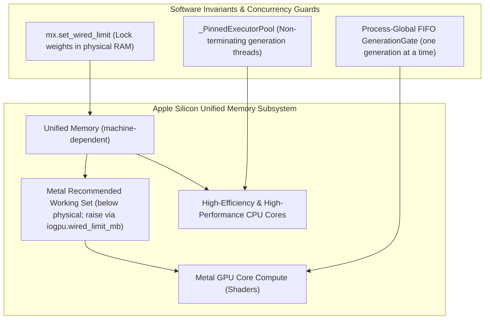
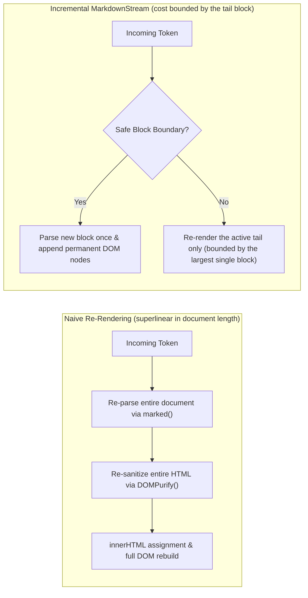

# Performance & Optimization Guide

This document covers the end-to-end performance architecture and optimization strategies implemented across `heylookitsanllm`, spanning Apple Silicon hardware utilization, in-process MLX caching, GGUF/`llama-server` flags, and frontend rendering pipelines.

---

## 1. Hardware & Engine Concurrency on Apple Silicon

Apple Silicon architecture features a high-bandwidth unified memory bus shared between CPU cores, the Metal GPU, and the Neural Engine. Achieving peak tokens-per-second requires coordinating memory access and execution threads carefully.

### 1.1. Single-Tenant Serialized Inference: Process FIFO Gate
- **Why one at a time**: the reason in [`generation_gate.py`](../../src/heylook_llm/providers/common/generation_gate.py) is **one GPU**, not bandwidth economics -- a single GPU with one loaded model and a shared KV cache admits one generation, so concurrent requests should queue and each complete rather than the newest aborting the in-flight one. [`mlx_provider.py`](../../src/heylook_llm/providers/mlx_provider.py) adds the cross-model half: serialize across all loaded MLX models, or two providers run concurrent generations on the shared Metal command queue. **No throughput mechanism is claimed** -- §3.5 below explains why an unmeasured causal story is exactly what this repo stopped writing down.
- **Scope**: the gate has two consumers, the MLX and llama-server providers.
- **Admission Queue**: admits waiting requests in arrival order up to the configured queue depth ([`config.py`](../../src/heylook_llm/config.py)); a request arriving when it is saturated gets HTTP 503 via `ModelBusyError`.
- **Queue Transparency**: Heylook acquires the gate *before* forwarding requests to `llama-server`. This avoids queueing requests inside `llama-server`'s internal HTTP queue where they could silently exceed socket read timeouts.

### 1.2. Thread Lifecycle: `_PinnedExecutorPool`
Earlier versions built one executor per request and shut it down at stream end. MLX keeps thread-local Metal state, and a pthread's TLS cleanup runs **after** its Python thread state is gone -- so deallocating those objects happens **without the GIL**, which is a `Py_FatalError` and a `SIGTRAP` process abort rather than an exception anything can catch.
- [`streaming_utils.py`](../../src/heylook_llm/streaming_utils.py) introduces **`_PinnedExecutorPool`**: worker threads allocated for MLX generation remain permanently alive for the lifetime of the process.

### 1.3. Memory Locking: `wired_limit`
Under memory pressure, macOS may compress inactive memory pages or swap them to disk.
- At startup, the server configures `mx.set_wired_limit()` to tell the macOS Mach kernel to lock active model weights into physical RAM, preventing paging pauses during generation.
- Each generation runs inside mlx-vlm's `wired_limit()` for stream synchronization, and `vlm_engine` calls `mx.reset_peak_memory()` at the request's start (the vision strategy does it before encoding images) so `mx.get_peak_memory()` is scoped per request.
- **`iogpu.wired_limit_mb` is the one lever that raises the Metal working set.** `scripts/gpu_wired_limit.sh` reads it (`status`, no root), sets it for the current boot, or installs it to persist -- the last two need root. Raising it is what flips large gguf models to the wider micro-batch on its own, and what the gguf provider's error text points at when a decode dies of "Compute error." The ceiling is **hard for MLX and advisory for llama.cpp**.

---

## 2. In-Process MLX Optimizations

### 2.1. The MLX Prefix Cache
Cross-request reuse on MLX is mlx-vlm's automatic prefix cache (APC), one in-memory store per loaded model, driven by [`vlm_engine`](../../src/heylook_llm/providers/common/vlm_engine.py) (the runtime visibility plan's W10). How it reuses depends on the model's cache layers:
- **Checkpoint models** (hybrid recurrent such as qwen3_5, sliding-window such as gemma-4 and gpt-oss) restore whole-cache checkpoints taken **during prefill**, at a fixed token interval near the end of the prompt plus the prompt's end. A follow-up restores the last checkpoint before the point where it diverges -- which is why these models reuse past their sliding window and why a hybrid's recurrent state is never sliced. The interval and the number of near-end checkpoints one request takes are `vlm_engine.APC_CHECKPOINT_INTERVAL_TOKENS` and `APC_CHECKPOINT_CAPTURES`; at mlx-vlm's defaults only the prompt end and one far boundary survive, and a follow-up finds nothing (measured in the W10 spike).
  - **A request also checkpoints where its system prompt ends**, so a new conversation with the same system prompt restores it instead of re-prefilling it. The point is found from the template in force, not from any family's role markers: `vlm_inputs.system_prefix_tokens` renders the system message followed by two different one-word user turns and cuts where the token lists part (once per system prompt and thinking setting, per loaded model). heylook installs this capture rule on each request's generator (`vlm_engine.install_capture_policy`); otherwise it is mlx-vlm's own rule. Because a conversation's later turns restore from the previous turn's snapshot, the system-prompt snapshot would be the store's oldest entry and age out after a few turns; each request that still starts with it marks it used (`vlm_engine.refresh_snapshots`).
  - **The store keeps many conversations' checkpoints** (`APC_CHECKPOINT_ENTRIES`), not one request's, so switching to another chat and back restores the first. mlx-vlm spends one number on both the checkpoints per request and the store size; heylook separates them, and the store's byte budget (mlx-vlm's `memory_max_bytes`) also bounds it (reasoned, not measured, to bind first on long contexts). Each retained snapshot costs every request a little CPU in mlx-vlm's byte accounting, which is why the count stays small ([measured]: internal/claude/improve scoreboard pairs ab2-ttft and ab3-ret).
- **Plain KV models** (qwen3, qwen3_vl) reuse hashed blocks of the prompt.

Every restore is checked the same way: `scripts/chain_probe.py` runs each hop of a multi-turn chain fresh and restored at temperature 0 and requires identical text. A divergence at an exact top-2 tie is rounding drift, not a restore bug; read the margin before concluding either way.

Rules the engine follows, each learned the hard way in the spike:
- **The cache key's salt is the request's media only**, computed the way mlx-vlm's server computes it. Left to the generator, the salt folds in the whole prompt's embeddings and no two different prompts ever share.
- **The disk tier stays off**: it would write prompt- and image-derived cache state to disk.
- **The memory budget is mlx-vlm's automatic one**, sized from the Metal working set and capped; `engine.cache.memory_budget_bytes` reports it. A cache clear or an unload drops the store.

Known gaps, each an accepted owner decision with its write-up under `internal/claude/w10/`:
- **A turn that adds a new image re-prefills.** The request's images are keyed as one hash, so a new image changes every key. A text follow-up in an image conversation (same images) reuses.
- **Plain KV vision models (qwen3_vl) do not reuse image turns**: the cache discards in-memory blocks that contain an image, and only the disk tier would serve them.

Lessons from the single-slot design this replaced (history: [sharp_edges.md](../architecture/sharp_edges.md#prompt-cache)): never hand out live cache objects, since a quarantined zombie generation keeps rebinding them; materialize snapshots on the thread that made them; and check both engines' cache classes before trusting a round trip (mlx-vlm's rotating cache kept its position in `meta_state`, which the slot once dropped).

### 2.2. Vision Feature LRU Cache
In multimodal VLM conversations, re-evaluating high-resolution images across multi-turn exchanges is computationally expensive.
- [`vision_feature_cache.py`](../../src/heylook_llm/providers/common/vision_feature_cache.py) maintains an LRU cache of encoded vision features, used only for models that expose `encode_image`.
- **The key is the request's whole image list**, every image URL in the conversation joined in order -- not one entry per image. A base64 upload is keyed by its data-URL string like any other; the pixel-hash fallback in that file is not reached from [the vision strategy](../../src/heylook_llm/providers/mlx_provider.py)'s call, since every entry in the list is a string.
- So a turn whose image list is unchanged passes `cached_image_features` to the language model and skips the vision tower, but a turn that **adds** an image misses and re-encodes every image in the history. A per-image cache is part of the plan's W10.

### 2.3. Streaming Detokenizer
The engine streams through **mlx-lm's** streaming detokenizer, vendored as [`lm_detokenizer.py`](../../src/heylook_llm/providers/common/lm_detokenizer.py) (mlx-lm itself is not a dependency), not mlx-vlm's. mlx-vlm's BPE detokenizer flushes only when a token starts with a space, so an answer with no spaces -- a count, code, CJK text -- arrives in one lump at the end; mlx-lm's streams per token (checked on Qwen3.5's tokenizer, 2026-09-23; the smoke walk-away check caught it).
- `MLXProvider.load_model` primes it with `model_path` (`generation_core.detokenizer_source`), so the class comes from tokenizer.json's decoder -- SPM or BPE -- instead of the naive one, which re-decodes the whole current line on every token.
- A continuation keeps its first token's leading space: `continuation_detokenizer` seeds a class with a settable `text`, and only such a class.

### 2.4. Logits Processors Receive a Batch Axis
A logits processor is called as `(tokens, logits)` with logits shaped **`(1, vocab)`** -- the engine passes `logits[:, -1, :]`, keeping the batch axis. Index the **vocab** axis (`logits.shape[-1]`, 1-D scratch vectors that broadcast), never `zeros_like(logits).at[tokens]`: that scatters along the size-1 batch axis, and MLX does not bounds-check a Metal scatter. The result is silent memory corruption followed by a mid-generation Metal fault and a poisoned process. Unit tests using 1-D logits stay green against it -- test the shape the engine actually sends.

---

## 3. GGUF / Llama-Server Optimizations

### 3.1. Embedded Metal Shaders
`scripts/build_llama.py` compiles `llama-server` with `GGML_METAL_EMBED_LIBRARY=ON`, putting the Metal shader **source** inside the binary; the OS's Metal compiler builds it when the process starts. The point is portability, not startup latency: the binary can be moved without dragging a loose shader file along, which is what a subprocess-spawning provider wants. A side effect worth knowing is that shader code generation tracks the installed macOS rather than Xcode (the [gguf runtime audit](../testing/gguf_runtime_audit_2026-09-23.md) §1 has the rest of the build review). `BUILD_SHARED_LIBS=OFF` completes that picture with a single self-contained static binary.

`GGML_METAL_NDEBUG` is deliberately **not** set. It compiles out load-time logging only -- including the *"allocated size is greater than the recommended max working set size"* warning, which is the ceiling that actually refuses loads on a big-unified-memory Mac. No throughput to gain, real diagnostics to lose.

### 3.2. KV Cache Quantization (`-ctk` / `-ctv`)
Long-context workloads can cause KV cache memory to rival model weights in size.
- **The KV cache is `f16` by default and stays that way.** `cache_type_k` / `cache_type_v` exist for headroom emergencies, not as a tuning default.
- When headroom is genuinely the binding constraint, quantizing key and value tensors frees unified memory for a larger context. No quality figure is quoted here because none has been measured on this hardware for these models. **A quantized V-cache needs flash attention** (§3.6), so check that before assuming `-ctv` is free.

### 3.3. Automatic Micro-Batch Sizing (`-ub`)
`n_ubatch` is unset by default and resolves **at spawn**, not to a constant:
- The provider sizes the model the way the admin fit panel does (weights plus sidecars against the live Metal working set) and reads the resulting headroom.
- Clearing the thin-headroom threshold gets the wider micro-batch; otherwise the spawn inherits llama-server's own default. Both the threshold and the wide value are constants in [`ram_fit.py`](../../src/heylook_llm/ram_fit.py) and [`llama_server_provider.py`](../../src/heylook_llm/providers/llama_server_provider.py) -- read them there. A stored `n_ubatch` wins over the auto answer in both directions.
- **The spawn log names the micro-batch it resolved.** The answer moves with `iogpu.wired_limit_mb` and with what else sits in the model directory, so a spawn quietly taking the narrow default would otherwise be indistinguishable from one quietly taking the wide one. (A *stored* value short-circuits the auto path without its own line; the full argv in the spawn log is what discloses that case.)

The wider micro-batch is a prefill win on dense and MoE models at no generation cost, but it costs materially more compute buffer -- which is why it is conditional. A vision model with thin headroom *loaded* at the wide setting (with `--fit` quietly trimming its context) and then died in its first decode with a Metal OOM that llama.cpp's own pre-flight never saw.

### 3.4. Idle Hibernation (`--sleep-idle-seconds`)
When `sleep_idle_seconds` is configured, `llama-server` frees model weights and KV buffers after the idle timeout while keeping the HTTP process alive. It is **strictly cheaper than heylook's own idle-unload**, which SIGTERMs the process group and respawns it -- that is the comparison the config field makes, and it is a local subprocess comparison, not a network one.

Do not read "cheaper" as "fast". A sleeping server **reloads the model before it emits anything**, and for a large model that reload is minutes rather than seconds -- which is why the provider raises its socket read timeout to the startup timeout for a wake instead of the normal SSE read timeout. How the weights come back is a per-model choice (`load_mode` / `-lm`), not fixed to `mmap`.

### 3.5. Speculative Decoding Mechanics & Observations
Speculative decoding uses a lightweight draft model or next-token prediction head (`-md`, `--spec-type`) to propose $N$ draft tokens that the main model verifies in a single forward pass.
- **DraftTuner** ([`generation_core.py`](../../src/heylook_llm/providers/common/generation_core.py), MLX only -- the gguf path's equivalents are spawn flags): keyed by model id, it tracks a rolling window of recent acceptance results and nudges the draft-token count up when acceptance runs high and down when it runs low, using the configured default until it has seen enough samples. Window size, both thresholds and the bounds are class constants on `DraftTuner`.
- **Speculative decoding defaults to OFF**, per model, with one standing carve-out: the DeepSeek-V4-Flash entry keeps it on (`draft-dspark`).

**What "default OFF" means here is *unproven*, not *known harmful*** -- and the durable content of this subsystem is measurement discipline rather than any number:

- On the one case examined most carefully -- a dense gemma-4 MTP model at vendor sampling, realistic context, matched warm cache, long generation -- spec on versus off was **a wash**, indistinguishable from noise. Every larger effect seen alongside it dissolved once one more variable was controlled: an apparent tuning win was a greedy artifact, an apparent cost was a short-generation artifact, an apparent context effect was a prompt-cache ordering mistake, and a "broken drafter" was refuted by the drafter's own output.
- **The mechanism is not understood.** Draft volumes collapse as context grows and no explanation for that has been established here, so attributing the wash to memory-bus contention would be a guess rather than a finding.
- `spec_draft_n_max` and `spec_draft_p_min` **interact, and the interaction inverts** -- a one-dimensional sweep of either finds a different and wrong optimum. There is no defensible global default: `p_min` values that help one model family cost throughput on another at every value tested.
- **Never measure this at temp 0.** Greedy acceptance is exact argmax matching; temp > 0 is rejection sampling. That is a different regime, not a quieter one. Temp 0 is fine for reproducibility and never for a throughput claim.
- Match prompt length, generation length, seed, sampling, **which binary**, and prompt-cache state across arms. An unmatched cache produced a large phantom that survived repeats and looked exactly like a finding. Matching every control you thought of only rules out the confounds you imagined.
- **Per-request reporting (v2.0.78).** `performance.speculative` carries drafted (gguf only), accepted and emitted, with `acceptance_rate` (accepted/drafted) and `draft_share` (accepted/emitted) as separate fields: the engines count different things, and one ratio name used to carry either. `performance.cache` says what each request reused of its prompt. Each assistant message keeps what its generation measured (`message_stats`, counts and enum tokens only) and shows it as a muted line under the message, and the perf page aggregates the same reports per model and per hour.

Conditions, history and the underlying figures live in `internal/research/` and in `GGUFModelConfig`'s own field comments. They are deliberately not reproduced in tracked docs: every number quoted for this subsystem has later needed a condition attached to stay true.

### 3.6. Flash Attention (`-fa`)
heylook does not pass `-fa`, so llama-server's `auto` applies, and on Metal it resolves on for the head dimensions served here. The vision tower inherits the setting. Forcing it off was measured slower for vision encoding and not faster for anything, so auto stays the default; the [audit](../testing/gguf_runtime_audit_2026-09-23.md) §9 has the comparison, and a per-model field for testing new architectures is the plan's W1.

### 3.7. Prompt Reuse and Vision Cost on gguf
- **Prompt reuse** is llama-server's own: the slot's longest common prefix, a host-RAM prompt cache (`-cram`) that restores earlier states across interleaved conversations, and context checkpoints for sliding-window and hybrid models. It covers image requests, and it depends on the template rendering history the same way it rendered it for generation. The mechanism is in [the deep dive](./llama_server_build_and_spawn.md#46-prompt-reuse-across-requests); the measured behaviour, and the template defect that broke one model's multi-turn reuse, are in the [audit](../testing/gguf_runtime_audit_2026-09-23.md) §5 and §10.
- **An image request's first token** costs the CPU decode of the image, the vision-tower encode, then ordinary prefill of the image tokens and the text. Several images in one request are encoded one after another. Every projector caps the tokens per image and resizes a larger image down before encoding, so above the cap a bigger file costs only its upload and CPU decode; below it, sending a smaller image is the direct lever.
- **Each engine resizes differently**, even for the same model family: different caps, rounding and pad-versus-stretch. The per-engine table is the [audit](../testing/gguf_runtime_audit_2026-09-23.md) §4, recorded as a dated fact rather than something to code against; reporting it per model from the engine itself is the plan's W4.

---

## 4. Frontend Rendering Optimizations

### 4.1. Incremental Markdown Streaming (`MarkdownStream`)
Streaming long responses into the browser DOM can saturate the JavaScript main thread if the full message is repeatedly re-parsed.
- [`markdown-stream.js`](../../frontend/js/markdown-stream.js) cuts only where no markdown construct can span the seam: a line after a blank line that is unindented, **not** a list marker (it would merge with the list above into one loose list) and **not** a blockquote `>`. Fence state is tracked open/close, so a cut never lands inside a fenced block.
- Two constructs instead **disable incremental rendering for the whole message**, because they reach forward past the only thing this scanner treats as a block break: link-reference / GFM footnote definitions, and CommonMark HTML blocks of types 1-5 (type 6 ends at a blank line and is deliberately excluded). That flag **latches** -- once set, every later paint re-renders the whole document. Correctness over speed, deliberately.
- **Prefix Commit**: Content prior to the boundary is parsed once, sanitized via DOMPurify, and committed to the DOM.
- **Tail Isolation**: Only the active, uncommitted tail is updated on each paint. This bounds rendering overhead to the size of the current paragraph or code block, rather than the entire document.

### 4.2. Layout Cache Preservation
- **Pre-Mutation Measurements**: In [`chat.js`](../../frontend/js/pages/chat.js), viewport and scroll distances are read at the top of the paint cycle *before* mutating DOM nodes. This allows the browser to return cached layout geometry without triggering forced synchronous reflows.
- **Removal of `content-visibility: auto`**: a skipped row reports its `contain-intrinsic-size` estimate rather than its real height until the engine lazily decides it is relevant, so `scrollHeight` lurches and **the engine moves `scrollTop` itself** (clamping, then scroll anchoring). Every scroll decision derives from those two values, so all of them were poisoned. It was measured **on Chrome** -- this is not a WebKit quirk. The reproduction, with its figures, is in the comment at the removal site in [`app.css`](../../frontend/css/app.css); the layout it saved was one-time and desktop-only.
- **Measure at the top of the painter, before it mutates -- both halves matter.** Before the write, the reads are cache hits (layout is still clean from the last paint) rather than a forced re-layout -- and since nothing skips off-screen rows any more, on any engine, a forced layout walks every row in the conversation. And only before the write is it *honest*: measured after, one paint appending more than the slack (a code block, a table) reads as "the reader scrolled away" and strands the view for the rest of the generation. A cached flag fed by scroll events was tried and is **wrong** -- pinning coalesces scroll events to a handful across a whole generation, so the flag goes stale exactly when the viewport changes under it, which on a phone is every keyboard open.

### 4.3. Paint Throttling
- Painters whose cost scales with the document use `ctx.throttleTime`, at the interval each page declares. Both streaming pages use it; a per-*frame* throttle would run up to 120 times a second, which is more work than anyone can read.
- `ctx.throttle` (per-frame, via `requestAnimationFrame`) exists on the page context but currently has **no consumers** -- it is the right tool only for work cheap enough that per-frame is free.
