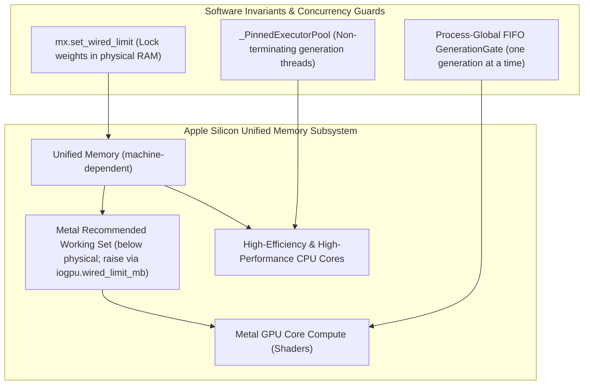
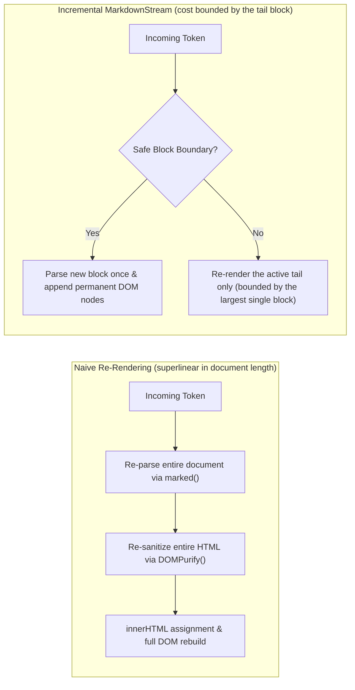

# Performance & Optimization Guide

This document covers the end-to-end performance architecture and optimization strategies implemented across `heylookitsanllm`, spanning Apple Silicon hardware utilization, in-process MLX caching, GGUF/`llama-server` flags, and frontend rendering pipelines.

---

## 1. Hardware & Engine Concurrency on Apple Silicon

Apple Silicon architecture features a high-bandwidth unified memory bus shared between CPU cores, the Metal GPU, and the Neural Engine. Achieving peak tokens-per-second requires coordinating memory access and execution threads carefully.

### 1.1. Single-Tenant Serialized Inference: Process FIFO Gate
- **Why one at a time**: the reason in [`generation_gate.py`](../../src/heylook_llm/providers/common/generation_gate.py) is **one GPU**, not bandwidth economics -- a single GPU with one loaded model and a shared KV cache admits one generation, so concurrent requests should queue and each complete rather than the newest aborting the in-flight one. [`mlx_provider.py`](../../src/heylook_llm/providers/mlx_provider.py) adds the cross-model half: serialize across all loaded MLX models, or two providers run concurrent generations on the shared Metal command queue. **No throughput mechanism is claimed** -- §3.5 below explains why an unmeasured causal story is exactly what this repo stopped writing down.
- **Scope**: the gate has two consumers, the MLX and llama-server providers. **`mlx_embedding` is unsupported right now** -- it never generates, so it never enters the gated path, and its forward pass is not serialized against one.
- **Admission Queue**: admits waiting requests in arrival order up to the configured queue depth ([`config.py`](../../src/heylook_llm/config.py)); a request arriving when it is saturated gets HTTP 503 via `ModelBusyError`.
- **Queue Transparency**: Heylook acquires the gate *before* forwarding requests to `llama-server`. This avoids queueing requests inside `llama-server`'s internal HTTP queue where they could silently exceed socket read timeouts.

### 1.2. Thread Lifecycle: `_PinnedExecutorPool`
Earlier versions built one executor per request and shut it down at stream end. MLX keeps thread-local Metal state, and a pthread's TLS cleanup runs **after** its Python thread state is gone -- so deallocating those objects happens **without the GIL**, which is a `Py_FatalError` and a `SIGTRAP` process abort rather than an exception anything can catch.
- [`streaming_utils.py`](../../src/heylook_llm/streaming_utils.py) introduces **`_PinnedExecutorPool`**: worker threads allocated for MLX generation remain permanently alive for the lifetime of the process.

### 1.3. Memory Locking: `wired_limit`
Under memory pressure, macOS may compress inactive memory pages or swap them to disk.
- At startup, the server configures `mx.set_wired_limit()` to tell the macOS Mach kernel to lock active model weights into physical RAM, preventing paging pauses during generation.
- Each generation runs inside a `wired_limit()` context manager for stream synchronization, and `run_generation` calls `mx.reset_peak_memory()` at its start so `mx.get_peak_memory()` is scoped per request.
- **`iogpu.wired_limit_mb` is the one lever that raises the Metal working set.** `scripts/gpu_wired_limit.sh` reads it (`status`, no root), sets it for the current boot, or installs it to persist -- the last two need root. Raising it is what flips large gguf models to the wider micro-batch on its own, and what the gguf provider's error text points at when a decode dies of "Compute error." The ceiling is **hard for MLX and advisory for llama.cpp**.

---

## 2. In-Process MLX Optimizations

### 2.1. Single-Slot Prompt Cache (The Q7 Architecture)
Prompt caching used to be a multi-branch radix tree. It was deleted for a failure that belonged to it, and the rewrite then caught a second failure that did **not** -- worth keeping straight, because they teach different lessons:
1. **Hybrid model corruption (the radix's own bug).** Restore-slicing recurrent cache state left stale state past the trim boundary, so a hybrid model emitted garbled tokens. It shipped documented as "technically incorrect but does not crash"; under exact prefix matching that latent wrongness became constant and live-verifiable.
2. **Process poisoning via shared live objects (caught during the rewrite, never shipped).** An intermediate single-slot design stored **live cache objects**. MLX arrays are immutable but cache *objects* are not: this server quarantines a wedged generator's worker thread alive, and a zombie generation keeps **rebinding** `.keys` / `.offset` on its own objects -- so sharing them handed the next request state mutating underneath it.

[`prompt_cache.py`](../../src/heylook_llm/providers/common/prompt_cache.py) implements the **Q7 Single-Slot Snapshot Architecture**:
- **Immutable Snapshots**: Stores a single cache slot per model containing immutable `(state, meta_state)` array snapshots of the most recent completed generation.
- **Immediate Materialization**: snapshots are materialized **on the generating thread**, before publication. This is thread affinity, not tidiness: evaluating a lazily-captured array later, from a different thread, raises "There is no Stream(gpu, N) in current thread" -- the crash written up in [`radix_thread_affinity.md`](../architecture/postmortems/radix_thread_affinity.md).
- **Two Sound Reuse Paths**:
  - **Extension (Multi-Turn)**: If the new prompt begins with the stored sequence, fresh cache objects are initialized from the snapshot and generation continues without re-evaluating historical tokens.
  - **Trim (Edits / Regenerate)**: if the prompt diverges mid-sequence, mlx-lm trims the stored tail. The trimmability check is **per-layer-type honest** and asks the whole cache list, so **one non-trimmable layer disables trim for the model**: recurrent state is a running summary rather than positional and never trims, and a rotated window has passed the point where a slice means anything. Those become a full re-prefill instead of a silently-wrong restore, which is why hybrids are **correct** here rather than "limited".
- **Switching conversations is a re-prefill.** One slot per model means exactly that, and it is an accepted trade rather than an oversight.
- **Never store or hand out live cache objects.** MLX *arrays* are immutable; cache *objects* are not. This server quarantines a wedged generator's worker thread alive, and a zombie generation keeps rebinding `.keys` / `.offset` on its own cache objects -- sharing those through the slot handed the next request state mutating underneath it (live-verified process poisoning, unreproducible single-threaded). Snapshot arrays are immune: the zombie rebinds its own attributes, the captured arrays never change.

### 2.2. Vision Feature LRU Cache
In multimodal VLM conversations, re-evaluating high-resolution images across multi-turn exchanges is computationally expensive.
- [`vision_feature_cache.py`](../../src/heylook_llm/providers/common/vision_feature_cache.py) maintains an LRU cache of encoded vision features keyed by image URL (or pixel content hash for base64 uploads).
- Subsequent turns referencing the same image pass `cached_image_features` directly to the language model, completely bypassing the heavy vision tower forward pass.

### 2.3. Detokenizer Performance Hardening
`mlx-lm` provides multiple detokenizer implementations:
- A generic `NaiveStreamingDetokenizer` re-decodes the entire accumulated line of text on every emitted token, resulting in $O(N^2)$ quadratic decoding overhead per line.
- `MLXProvider.load_model` primes `TokenizerWrapper` with `model_path`, so mlx-lm's own loader picks the SPM or BPE streaming detokenizer instead of falling back to the naive one. The source characterizes only the fallback (quadratic per line, because it re-decodes the whole current line on every token); it makes no claim about the replacement's cost curve, and neither should this page.
- **There are two tokenizer shapes at generation time.** mlx-lm's `load` hands the text path a `TokenizerWrapper` with a chosen streaming detokenizer; mlx-vlm's processor hands the vision path a **raw HF tokenizer**, which `run_generation` wraps via `ensure_gen_tokenizer`. A wrapper built without `model_path` takes mlx-lm's default, `NaiveStreamingDetokenizer`, whose `text` is additionally a **read-only property** -- so `continuation_detokenizer` seeds only a class with a settable `text`. Seeding unconditionally raised inside the first `next()` of every continuation on every mlx-vlm-routed model. **A check on the mlx-lm path says nothing about the mlx-vlm path, and the reverse.**

### 2.4. Logits Processors Receive a Batch Axis
A logits processor is called as `(tokens, logits)` with logits shaped **`(1, vocab)`** -- mlx-lm passes `logits[:, -1, :]`, keeping the batch axis. Index the **vocab** axis (`logits.shape[-1]`, 1-D scratch vectors that broadcast), never `zeros_like(logits).at[tokens]`: that scatters along the size-1 batch axis, and MLX does not bounds-check a Metal scatter. The result is silent memory corruption followed by a mid-generation Metal fault and a poisoned process. Unit tests using 1-D logits stay green against it -- test the shape mlx-lm actually sends.

---

## 3. GGUF / Llama-Server Optimizations

### 3.1. Embedded Metal Shaders
`scripts/build_llama.py` compiles `llama-server` with `GGML_METAL_EMBED_LIBRARY=ON`, putting the `.metallib` **inside** the binary. The point is portability, not startup latency: the binary can be moved without dragging a loose shader file along, which is what a subprocess-spawning provider wants. `BUILD_SHARED_LIBS=OFF` completes that picture with a single self-contained static binary.

`GGML_METAL_NDEBUG` is deliberately **not** set. It compiles out load-time logging only -- including the *"allocated size is greater than the recommended max working set size"* warning, which is the ceiling that actually refuses loads on a big-unified-memory Mac. No throughput to gain, real diagnostics to lose.

### 3.2. KV Cache Quantization (`-ctk` / `-ctv`)
Long-context workloads can cause KV cache memory to rival model weights in size.
- **The KV cache is `f16` by default and stays that way.** `cache_type_k` / `cache_type_v` exist for headroom emergencies, not as a tuning default.
- When headroom is genuinely the binding constraint, quantizing key and value tensors frees unified memory for a larger context. No quality figure is quoted here because none has been measured on this hardware for these models. **A quantized V-cache needs flash attention**, so check that before assuming `-ctv` is free.

### 3.3. Automatic Micro-Batch Sizing (`-ub`)
`n_ubatch` is unset by default and resolves **at spawn**, not to a constant:
- The provider sizes the model the way the admin fit panel does (weights plus sidecars against the live Metal working set) and reads the resulting headroom.
- Clearing the thin-headroom threshold gets the wider micro-batch; otherwise the spawn inherits llama-server's own default. Both the threshold and the wide value are constants in [`ram_fit.py`](../../src/heylook_llm/ram_fit.py) and [`llama_server_provider.py`](../../src/heylook_llm/providers/llama_server_provider.py) -- read them there. A stored `n_ubatch` wins over the auto answer in both directions.
- **The spawn log names the micro-batch it resolved.** The answer moves with `iogpu.wired_limit_mb` and with what else sits in the model directory, so a spawn quietly taking the narrow default would otherwise be indistinguishable from one quietly taking the wide one. (A *stored* value short-circuits the auto path without its own line; the full argv in the spawn log is what discloses that case.)

The wider micro-batch is a prefill win on dense and MoE models at no generation cost, but it costs materially more compute buffer -- which is why it is conditional. A vision model with thin headroom *loaded* at the wide setting (with `--fit` quietly trimming its context) and then died in its first decode with a Metal OOM that llama.cpp's own pre-flight never saw.

### 3.4. Idle Hibernation (`--sleep-idle-seconds`)
When `sleep_idle_seconds` is configured, `llama-server` frees model weights and KV buffers after the idle timeout while keeping the HTTP process alive. It is **strictly cheaper than heylook's own idle-unload**, which SIGTERMs the process group and respawns it -- that is the comparison the config field makes, and it is a local subprocess comparison, not a network one.

Do not read "cheaper" as "fast". A sleeping server **reloads the model before it emits anything**, and for a large model that reload is minutes rather than seconds -- which is why the provider raises its socket read timeout to the startup timeout for a wake instead of the normal SSE read timeout. How the weights come back is a per-model choice (`load_mode` / `-lm`), not fixed to `mmap`.

### 3.5. Speculative Decoding Mechanics & Observations
Speculative decoding uses a lightweight draft model or next-token prediction head (`-md`, `--spec-type`) to propose $N$ draft tokens that the main model verifies in a single forward pass.
- **DraftTuner** ([`generation_core.py`](../../src/heylook_llm/providers/common/generation_core.py), MLX only -- the gguf path's equivalents are spawn flags): keyed by model id, it tracks a rolling window of recent acceptance results and nudges the draft-token count up when acceptance runs high and down when it runs low, using the configured default until it has seen enough samples. Window size, both thresholds and the bounds are class constants on `DraftTuner`.
- **Speculative decoding defaults to OFF**, per model, with one standing carve-out: the DeepSeek-V4-Flash entry keeps it on (`draft-dspark`).

**What "default OFF" means here is *unproven*, not *known harmful*** -- and the durable content of this subsystem is measurement discipline rather than any number:

- On the one case examined most carefully -- a dense gemma-4 MTP model at vendor sampling, realistic context, matched warm cache, long generation -- spec on versus off was **a wash**, indistinguishable from noise. Every larger effect seen alongside it dissolved once one more variable was controlled: an apparent tuning win was a greedy artifact, an apparent cost was a short-generation artifact, an apparent context effect was a prompt-cache ordering mistake, and a "broken drafter" was refuted by the drafter's own output.
- **The mechanism is not understood.** Draft volumes collapse as context grows and no explanation for that has been established here, so attributing the wash to memory-bus contention would be a guess rather than a finding.
- `spec_draft_n_max` and `spec_draft_p_min` **interact, and the interaction inverts** -- a one-dimensional sweep of either finds a different and wrong optimum. There is no defensible global default: `p_min` values that help one model family cost throughput on another at every value tested.
- **Never measure this at temp 0.** Greedy acceptance is exact argmax matching; temp > 0 is rejection sampling. That is a different regime, not a quieter one. Temp 0 is fine for reproducibility and never for a throughput claim.
- Match prompt length, generation length, seed, sampling, **which binary**, and prompt-cache state across arms. An unmatched cache produced a large phantom that survived repeats and looked exactly like a finding. Matching every control you thought of only rules out the confounds you imagined.

Conditions, history and the underlying figures live in `internal/research/` and in `GGUFModelConfig`'s own field comments. They are deliberately not reproduced in tracked docs: every number quoted for this subsystem has later needed a condition attached to stay true.

---

## 4. Frontend Rendering Optimizations

### 4.1. Incremental Markdown Streaming (`MarkdownStream`)
Streaming long responses into the browser DOM can saturate the JavaScript main thread if the full message is repeatedly re-parsed.
- [`markdown-stream.js`](../../frontend/js/markdown-stream.js) cuts only where no markdown construct can span the seam: a line after a blank line that is unindented, **not** a list marker (it would merge with the list above into one loose list) and **not** a blockquote `>`. Fence state is tracked open/close, so a cut never lands inside a fenced block.
- Two constructs instead **disable incremental rendering for the whole message**, because they reach forward past the only thing this scanner treats as a block break: link-reference / GFM footnote definitions, and CommonMark HTML blocks of types 1-5 (type 6 ends at a blank line and is deliberately excluded). That flag **latches** -- once set, every later paint re-renders the whole document. Correctness over speed, deliberately.
- **Prefix Commit**: Content prior to the boundary is parsed once, sanitized via DOMPurify, and committed to the DOM.
- **Tail Isolation**: Only the active, uncommitted tail is updated on each paint. This bounds rendering overhead to the size of the current paragraph or code block, rather than the entire document.

### 4.2. Layout Cache Preservation
- **Pre-Mutation Measurements**: In [`chat.js`](../../frontend/js/pages/chat.js), viewport and scroll distances are read at the top of the paint cycle *before* mutating DOM nodes. This allows the browser to return cached layout geometry without triggering forced synchronous reflows.
- **Removal of `content-visibility: auto`**: a skipped row reports its `contain-intrinsic-size` estimate rather than its real height until the engine lazily decides it is relevant, so `scrollHeight` lurches and **the engine moves `scrollTop` itself** (clamping, then scroll anchoring). Every scroll decision derives from those two values, so all of them were poisoned. It was measured **on Chrome** -- this is not a WebKit quirk. The reproduction, with its figures, is in the comment at the removal site in [`app.css`](../../frontend/css/app.css); the layout it saved was one-time and desktop-only.
- **Measure at the top of the painter, before it mutates -- both halves matter.** Before the write, the reads are cache hits (layout is still clean from the last paint) rather than a forced re-layout -- and since nothing skips off-screen rows any more, on any engine, a forced layout walks every row in the conversation. And only before the write is it *honest*: measured after, one paint appending more than the slack (a code block, a table) reads as "the reader scrolled away" and strands the view for the rest of the generation. A cached flag fed by scroll events was tried and is **wrong** -- pinning coalesces scroll events to a handful across a whole generation, so the flag goes stale exactly when the viewport changes under it, which on a phone is every keyboard open.

### 4.3. Paint Throttling
- Painters whose cost scales with the document use `ctx.throttleTime`, at the interval each page declares. Both streaming pages use it; a per-*frame* throttle would run up to 120 times a second, which is more work than anyone can read.
- `ctx.throttle` (per-frame, via `requestAnimationFrame`) exists on the page context but currently has **no consumers** -- it is the right tool only for work cheap enough that per-frame is free.
