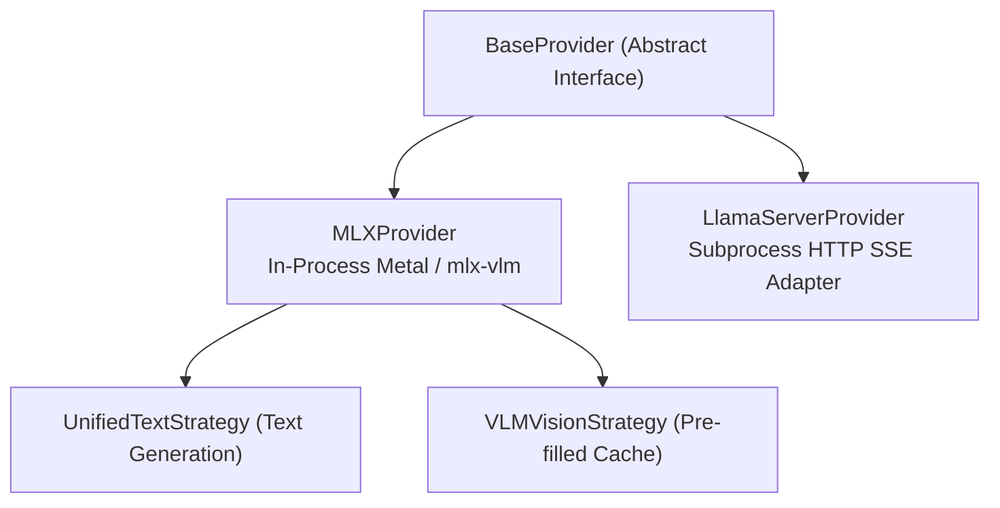

# Providers Architecture

This document explains the provider subsystem in `heylookitsanllm`. Providers bridge abstract generation requests to specific hardware backends and inference engines.

---

## 1. Provider Topology & Contracts

All providers inherit from [`BaseProvider`](../../src/heylook_llm/providers/base.py). Two are registered (the `mlx_embedding` provider was removed in v2.0.41; nothing used it).

```python
# src/heylook_llm/config.py
PROVIDER_CONFIG_CLASSES = {
    "mlx": MLXModelConfig,
    "gguf": GGUFModelConfig,
}
```



### 1.1. BaseProvider Interface Contract
Only two members are `@abstractmethod`; the rest are concrete base-class behaviour a provider may override.

**Must implement:**
- **`load_model()`**: Initializes the model (in-process MLX weights, or the GGUF `llama-server` process).
- **`create_chat_completion(request: ChatRequest, abort_event=None)`**: Generator yielding `GenerationChunk` objects.

**Declared on the base, but the base bodies are stubs -- the behaviour is in the overrides:**
- **`render_prompt(request) -> str`**: the contract is "render the exact prompt the model sees, without taking an execution slot". The **base raises `NotImplementedError`**; MLX and llama-server implement it.
- **`check_capacity()`**: the contract is "raise `ModelBusyError` (HTTP 503) when the queue is saturated". The **base is a no-op** -- no admission limit -- so a provider that does not override it has none.
- **`unload()`**, **`warmup()`**, **`get_metrics()`**, **`clear_cache()`**, **`get_tokenizer()`**, **`template_info()`**, **`thinking_capable`**, **`effective_thinking()`**, **`generation_queue_stats()`** are likewise declared here with defaults.

Read a stub as a contract, not as inherited behaviour: a provider that inherits the no-op `check_capacity` is ungated.

### 1.3. The Engine Contract (`engine` on every model row)

Every engine answers the same questions about a model, and `/v1/models`, the admin row and the frontend read one shape: [`providers/contract.py`](../../src/heylook_llm/providers/contract.py)'s `EngineDescription`. The same keys appear for every engine:

- `runtime` -- the library that runs the model (`mlx-vlm`, `llama.cpp`).
- `context` -- `length`, the ceiling the model's files declare, and `running`, what a resident gguf process was sized to (not applicable on MLX).
- `template` -- which ladder rung won, the file, and the sha256 of the body the next load will use beside the one the running process loaded; and `prefix_stable`, the lint that says whether each turn's prompt extends the previous one's the way a prompt cache needs ([`chat_template_files.prefix_stability`](../../src/heylook_llm/chat_template_files.py): history before the generation prompt must re-render identically, and the generation prompt must share its start with the next turn's render of the reply).
- `settings` -- every configurable field of the provider plus the load decisions that have no field (gguf: `binary`, `image_max_tokens`, `metal_keep_alive`), each as `{value, configured, auto, reason, provenance, effect}`.
- `cache` -- how the model's prompt is reused across requests, as Facts. gguf gives the reuse class read from the header (a recurrent or sliding-window model is checkpointed, full attention truncates anywhere), KV shift (off whenever a projector loads), the host-RAM prompt-cache budget and the checkpoint settings, each as the spawn will get it. MLX gives the prefix cache (mlx-vlm's APC, in memory per loaded model): its reuse mode (checkpoints or hashed blocks) and whether images reuse, both decided at load; the checkpoint interval and entries (`vlm_engine` constants); the memory budget; and that the disk tier is off. What one request actually reused is its `usage`, not this.
- `thinking`, `image`, `steering` -- explicit nulls until the workstreams that fill them land.

Each value carries its **provenance** (`derived`, `configured`, `observed`, `observed_cached`, `unknown`, `not_applicable`), so a client never infers where a value came from.

It is built in two halves. The **static half** is one module per engine ([`mlx_describe.py`](../../src/heylook_llm/providers/mlx_describe.py), [`gguf_describe.py`](../../src/heylook_llm/providers/gguf_describe.py)): plain functions over the config and the model's files, so it answers for models that are not loaded. It is cached by a stat-only stamp over every file that can change the answer. The **observed half** is `describe_observed()` on the loaded provider, read back from what `load_model` recorded (the auto micro-batch, the image cap, the binary, the prompt-cache verdict). It never calls into the running process, so a model listing never waits on a generation.

Both halves call the **same decision functions** the spawn and the request path use, so the report cannot drift from behaviour. A value counts as `configured` only when a models.toml entry stores it **and** it differs from what discovery derives for that file. A stored copy of a derived value reads as derived. No absolute path appears in `engine`. The frontend reads values through [`js/engine.js`](../../frontend/js/engine.js). Why it is shaped this way: [sharp_edges.md#one-engine-contract](../architecture/sharp_edges.md#one-engine-contract).

### 1.2. The `GenerationChunk` Invariant
Providers yield [`GenerationChunk`](../../src/heylook_llm/providers/base.py) dataclass instances:
- **Slotted Fields** (`@dataclass(slots=True)`, complete set): `text`, `token`, `thinking`, `finish_reason`, `prompt_tokens`, `generation_tokens`, `prompt_tps`, `generation_tps`, `peak_memory`, `queue_wait_ms`, `cache` (a `CacheReport`), `spec` (a `SpecReport`).
- **`slots=True` is deliberate**: attaching undeclared attributes was the old extension mechanism and must now fail loudly. New telemetry gets a **field here**, absorbed in `perf_collector.ChunkTelemetry.absorb()` -- never an attribute patch at a call site.
- `prompt_tokens` is the **whole prompt on every engine** (plan W5). The engines count differently at the source -- mlx-vlm's engine prefills only the tail its prefix cache did not restore, llama-server reports the whole prompt beside its cached count -- so each provider normalizes at its boundary.
- `cache` (`CacheReport`: whole prompt, cached, outcome `reused`/`miss`/`ineligible`, cause, reason; on gguf the cause comes from the cache witness, see [prompt reuse](./llama_server_build_and_spawn.md#46-prompt-reuse-across-requests)) and `spec` (`SpecReport`: `drafted` (gguf only), `accepted`, `emitted`) are **per-request reports**. MLX stamps the cache report on the first chunk (`reused`, or `miss` with cause `cold` or `new_image_set`; `vlm_engine.cache_report`) and has no spec decode, so no spec report; llama-server reports both on its final frames. The telemetry collector **latches the latest not-None** report. The wire's `usage` (Anthropic-shaped: `input_tokens` processed, `cache_read_input_tokens` reused) and `performance.cache`/`performance.speculative` are built from these in one place (`perf_collector`). The two spec-decode rates (`acceptance_rate` = accepted/drafted, `draft_share` = accepted/emitted) are separate fields, never merged.
- **Pre-Split Reasoning**: If an engine natively splits reasoning (such as `llama-server`'s `reasoning_content` delta), it is placed directly into `chunk.thinking`.
- **Error Surfacing Policy**: Providers **never** yield error chunks. Internal errors must **raise** typed exceptions:
  - `InvalidGenerationRequest`: client-side error. HTTP 400 **before** headers go out; once streaming has started it becomes an in-band `invalid_request_error` SSE event.
  - `GenerationFailed`: engine/hardware failure. HTTP 500 before headers, an in-band `api_error` SSE event after. `InvalidGenerationRequest` subclasses it.

---

## 2. MLXProvider: Unified Text & Vision

[`MLXProvider`](../../src/heylook_llm/providers/mlx_provider.py) handles both text-only LLMs and multimodal Vision-Language Models (VLMs) running natively on Apple Silicon Metal.

### 2.1. One Engine: mlx-vlm
Every MLX model, text-only included, loads with `mlx_vlm.utils.load` and generates on mlx-vlm's own engine (the runtime visibility plan's W10, outcome A2). mlx-vlm has native ports of the text-only families served here, and on them its greedy output matches mlx-lm's token for token (the W10 spike; record in `internal/claude/w10/`). `engine.runtime` therefore reads `mlx-vlm` for every MLX model (and `llama.cpp` for gguf), answered for unloaded models too.

[`loader_routing.py`](../../src/heylook_llm/providers/common/loader_routing.py) resolves one bool, `resolve_serves_vision`, which `is_vlm` is; it picks no library (the `loader` field that could force one was retired in stage 3; the checkpoint's declared `modalities` and whether mlx-vlm registers its `model_type` are the inputs). It decides whether a model is served as vision-capable (the reported `vision` capability and the provider's image guard read the same resolver, so `/v1/models` cannot advertise images a 400 then refuses) and which template path renders the prompt.

Because it reads each model directory's `config.json`, the two admin read routes that build a model response are plain `def` (threadpool), not `async def`.

### 2.2. The Generation Path: `vlm_engine`
[`vlm_engine.generate`](../../src/heylook_llm/providers/common/vlm_engine.py) runs one request through one mlx-vlm `BatchGenerator`, with mlx-vlm's automatic prefix cache (APC) held per loaded model -- the way mlx-vlm's own server serves requests. The strategies only build the request:
- **`UnifiedTextStrategy`** renders the prompt (the template path, thinking, continuation shapes), tokenizes it through mlx-vlm's `prepare_inputs` like mlx-vlm's own loop, and hands it to the engine.
- **`VLMVisionStrategy`** does the same with the images: `prepare_inputs` builds the pixel tensors and the expanded prompt, the vision feature cache supplies cached image features to the embedding step only, and the engine prefills the whole prompt.
- **`DiffusionStrategy`** covers mlx-vlm diffusion models on their own denoising engine; it does not use `vlm_engine`.

What heylook keeps as its own inside the engine: its sampler and logits processors (penalties scoped to generated tokens by `generation_core.generated_only`), its stop set (resolved once at load and checked in the engine's loop; nothing is added to the shared tokenizer), its streaming detokenizer (§2.4), per-request timing and peak memory, and the `CacheReport`. Prefill progress is read after every prefill chunk from the prompt batch (private fields mlx-vlm's server also reads, pinned by `TestVlmEngineSurface`), and a cancel removes the request between chunks. A generator is closed on the thread that made it; its stream is thread-local.

### 2.3. Audio Input Is a Loud Refusal on MLX
Audio towers are stripped at load on the MLX path, so `input_audio` content parts are **gguf-only**. The 400 guard lives in `MLXProvider.create_chat_completion` and must stay loud -- silently dropping an audio part would produce a confident answer about nothing.

### 2.4. Stop-Token & Detokenizer Hardening
- **EOS union at load** ([`stop_tokens.py`](../../src/heylook_llm/providers/common/stop_tokens.py)): a raw HF tokenizer does not absorb `generation_config.json`, so a model whose tokenizer declares one eos while its generation config declares several will generate straight past its own end-of-turn. `MLXProvider` unions the generation-config ids into the tokenizer's set at load. Gemma 4 is the live case.
- Do not confuse that with the **dual-source special-token read** in [`template_info.py`](../../src/heylook_llm/providers/common/template_info.py), which merges `tokenizer_config.json`'s `added_tokens_decoder` with `tokenizer.json`'s `added_tokens` to build an id-to-string map for template validation and the strip set. Different files, different purpose: only the first feeds the stop set generation halts on.
- **Streaming detokenizer**: the engine streams through mlx-lm's detokenizer, vendored as `lm_detokenizer.py` (mlx-lm is not a dependency), primed at load with `model_path` (`detokenizer_source`), with the continuation seam seeded (`continuation_detokenizer`). mlx-vlm's own BPE detokenizer holds every token until the end when none starts with a space -- a count, code, CJK text -- so an answer like that would arrive in one lump; the smoke walk-away check caught it.

---

## 3. LlamaServerProvider (GGUF) Overview

[`LlamaServerProvider`](../../src/heylook_llm/providers/llama_server_provider.py) provides out-of-process serving of quantized GGUF models via `llama-server`:
- Spawns one isolated subprocess per resident model.
- Communicates over localhost HTTP via Server-Sent Events (SSE).
- Uses `-np 1` with process-level FIFO queue synchronization.
- Pre-splits reasoning traces via `reasoning_content`.
- Implements the chat template ladder: explicit path, then the operator override beside the weights, then the publisher sidecar, then the GGUF-embedded template.

*(For the complete deep dive on building `llama-server`, process lifecycle, CLI flags, and parameter resolution, see [**Llama-Server & GGUF Deep Dive**](./llama_server_build_and_spawn.md).)*

### 3.1. Where the Two Engines Differ: Prompt Reuse and Image Geometry

The same model can behave differently on the two engines in ways no config field shows. Two matter most.

**Prompt reuse across requests.**
- *gguf*: `llama-server` reuses the longest common prefix from its slot, restores earlier states from a host-RAM prompt cache, and on sliding-window and hybrid models restores context checkpoints. Image requests are covered, and an image before the match point is not re-encoded. See [its prompt reuse](./llama_server_build_and_spawn.md#46-prompt-reuse-across-requests).
- *MLX*: mlx-vlm's prefix cache, in memory per loaded model ([performance guide §2.1](./performance_optimizations.md#21-the-mlx-prefix-cache)). Hybrid and sliding-window models restore checkpoints taken during prefill; plain KV models reuse hashed blocks. Text follow-ups reuse on every class, and so does a text follow-up in an image conversation on the checkpoint classes. Two known gaps: a turn that adds a new image re-prefills (the request's images are keyed as one hash), and plain KV vision models (qwen3_vl) do not reuse image turns while the cache's disk tier is off.

The engine switch was the [runtime visibility plan](../project/plan_runtime_visibility.md)'s W10; reporting each request's cache outcome on both engines is its W5.

**Image geometry.** Each engine maps an image's size to a resized size and a token count with its own preprocessing, and they disagree even for one model family: a different per-image token cap, different rounding at a half unit, padding on one side and stretching on the other. So image cost and what the model actually sees must be reasoned about per engine and per model, never per family. The dated per-engine table is the [gguf runtime audit](../testing/gguf_runtime_audit_2026-09-23.md) §4; on llama.cpp the per-image limits are hard-coded per projector rather than read from the model's files, which is why the plan's W4 reports geometry from each engine instead of from a copied table.

---

## 3.5. Which Config Fields Apply to Which Engine

Do not look for that answer here, and do not write a table of it anywhere.
It is declared at each field and served, derived, from
[`GET /v1/admin/model-options`](../../src/heylook_llm/admin_api.py):

```
GET /v1/admin/model-options
  providers.<provider>.fields[]
    name          the config key
    effect        WHEN a change lands (per_request, requires_reload, ...)
    description   what it does and why you would reach for it
    arg, ui, shape, reason, type, default, bounds, enum
```

**The provider key is the engine.** Each provider runs one engine since plan
W10 (every MLX model on mlx-vlm), so a field reaches the engine of the config
class that declares it. Until v2.0.89 an `engines` tag restated that per
field; it was removed once it could only ever repeat the class. One exception,
named in the field's own description:

- `max_queue_depth` is declared on the MLX config but configures the
  process-global generation gate that gguf generations queue in too (the gguf
  provider looks for the same key on its own config, where no such field
  exists, and so always contributes the default).

When a field is inert on some architectures of its engine, its own
`description` has to say so. (The MLX KV-cache knobs were the case, silently
inert wherever a model defined its own `make_cache`; they were retired with
the mlx-vlm engine in plan W10 stage 3.)

Fields that exist on one engine and have no counterpart on the other are the
common case, and the descriptions name the counterpart where one exists. The
pair worth knowing before reasoning about either:

- gguf `ctx_size` is a REAL allocation -- llama-server sizes the KV slot at
  spawn, so lowering it reclaims memory and can make a model load that
  otherwise would not.
- MLX `context_length` allocates nothing. The MLX KV cache grows lazily in
  256-token steps and is constructed per generation, not at load, so the field
  cannot reduce load time, time-to-first-token or memory. Its only consumers
  are the over-length refusal and the admin row.

Importing the gguf intuition into MLX is the specific mistake this section
exists to stop.

**Adding a field.** Declare `effect` and `description` on it.
`config.py` refuses to import otherwise, and
`tests/unit/test_config_effects.py` covers the same ground for the suite. Do
not add the facts to this page instead: a hand-maintained second copy of what
the config classes already know is this repo's named defect class, and it has
already cost it the reload set, the import allowlist and three more.

---

## 4. Reasoning Parsers & Stream Separation

Models format their internal reasoning in diverse, vendor-specific ways. The parser subsystem ([`reasoning_parser.py`](../../src/heylook_llm/reasoning_parser.py)) separates reasoning thoughts from final assistant content:

`select_reasoning_parser()` picks exactly one of **four** routing parsers off `ModelTemplateInfo`, in this order:

| Engine / Family | Selector | Routing Parser | Handling |
| :--- | :--- | :--- | :--- |
| **gpt-oss / harmony** | `has_harmony_structure` | `HarmonyChannelParser` | Tracks harmony channel markers. **Both** `analysis` and `commentary` route to thinking; everything else is text. |
| **Gemma 4** | `has_gemma_channel_structure` | `GemmaChannelParser` | Same shape, gemma's own thought/content channels. |
| **DeepSeek / Qwen** | `has_thinking_markers` | `HybridThinkingParser` (lives in `thinking_parser.py`) | State machine over `<think>` / `</think>`. |
| **GGUF (`llama-server`)**, and any model with none of the above | *(fallthrough)* | `PassThroughParser` | The provider's `template_info()` is `None`, so routing is pass-through by construction. `llama-server` has already pre-split `reasoning_content`; re-parsing another engine's split output is exactly what this avoids. |

Two selection subtleties, both about where a stream *starts*:
- `prefills_thinking` is consulted in the **marker branch only** -- the channel parsers never look at it. There, a template that pre-fills an unclosed `<think>` means the model's output begins **inside** the block, so the parser starts in thinking state, but only when thinking is actually enabled *and* the request is not a **continuation**. A continuation has no generation prompt at all, so nothing opened a block, and a parser armed that way would misfile the whole continuation as thinking.
- A content continuation (the final assistant message has text) is rendered on the **generation prompt** plus that text whenever the template's history render drops part of what the generation prompt put before the reply -- gemma-4 with thinking off opens an empty thought channel there that its history render omits, and without it the continuation degrades. Otherwise the template's own `continue_final_message` render stands. One helper, [`continue_from_generation_prompt`](../../src/heylook_llm/providers/common/vlm_inputs.py), on the text and vision paths.
- `resumes_thinking` is the one continuation that *does* start inside the block: the final assistant message carries thinking and no content, so the provider reopened the block. All three routing parsers accept it -- harmony starts inside `analysis`, gemma inside `thought`, the marker parser inside `<think>`.

Both rules live in one function, [`starts_inside_thinking`](../../src/heylook_llm/reasoning_parser.py), which the MLX thinking budget reads too.

### Thinking budget (plan W7)
A request's `thinking.budget_tokens` (`ChatRequest.thinking_budget_tokens`) is a hard cap enforced by the engine, never by heylook's text: on gguf it is llama-server's per-request `reasoning_budget_tokens` (applied where llama-server found the template's thinking end tags), and on MLX it is mlx-vlm's `ThinkingBudgetCriteria`, handed to the `BatchGenerator` per request. Past the budget the criteria force a newline and the close token, and those forced tokens stream like any other, so the parsers see an ordinary closed block. The criteria can force only ONE close token, so [`thinking_budget_markers`](../../src/heylook_llm/providers/common/template_info.py) offers `<think>`/`</think>` and gemma-4's channel and refuses harmony; the `thinking_budget` capability and the provider both read it, so the control appears exactly where it is enforced, and a budget sent to a harmony MLX model is a 400.

### StripSpecials Wrapper
Stripping is **not** each parser's job. Declared control tokens (including non-`<`-shaped families such as Mistral's `[INST]`) are removed by one wrapper, [`StripSpecials`](../../src/heylook_llm/reasoning_parser.py), composed over whichever routing parser was selected -- and only when the model declares specials, so a model declaring none gets the bare parser.

It strips **after** routing, so the inner parser still sees the raw stream its state machine was written for. Its holdback is a **prefix-set membership test, not a fixed-size buffer**: the held-back tail is the longest suffix of the emitted text that is still a proper prefix of some declared special. That is what makes it correct regardless of how long a special is relative to the inner parser's own structural tokens -- an inner parser's buffering can emit a control token in two halves across separate deltas, and a per-delta `sub()` misses both.

`strip_specials=False` composes no wrapper at all, for the frontend's "Show special tokens" display preference. Routing is unaffected either way: a routing parser still consumes its own structural tokens, because those are what it splits with.

Behaviour is pinned by **properties**, not examples (`TestParserInvariants`): output is invariant to how the stream was chunked, and text carrying no structural tokens survives intact.
