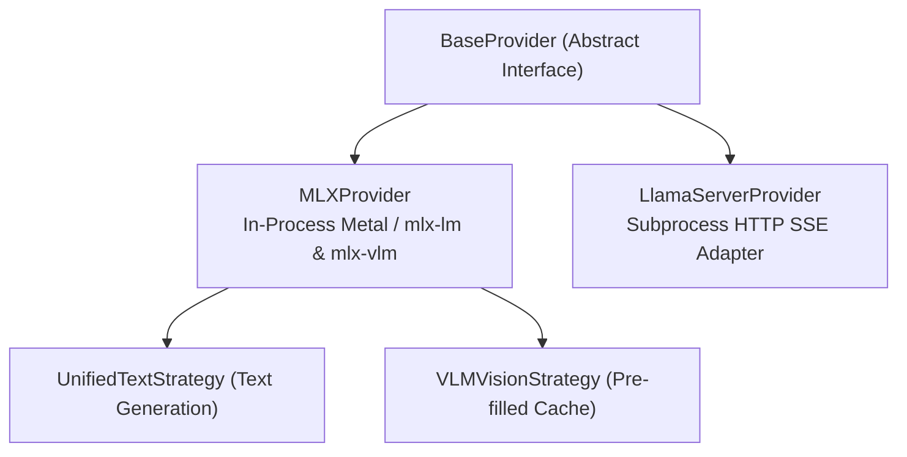

# Providers Architecture

This document explains the provider subsystem in `heylookitsanllm`. Providers bridge abstract generation requests to specific hardware backends and inference engines.

---

## 1. Provider Topology & Contracts

All providers inherit from [`BaseProvider`](../../src/heylook_llm/providers/base.py). Two are registered (the `mlx_embedding` provider was removed in v2.0.41; nothing used it).

```python
# src/heylook_llm/config.py
PROVIDER_CONFIG_CLASSES = {
    "mlx": MLXModelConfig,
    "gguf": GGUFModelConfig,
}
```



### 1.1. BaseProvider Interface Contract
Only two members are `@abstractmethod`; the rest are concrete base-class behaviour a provider may override.

**Must implement:**
- **`load_model()`**: Initializes the model (in-process MLX weights, or the GGUF `llama-server` process).
- **`create_chat_completion(request: ChatRequest, abort_event=None)`**: Generator yielding `GenerationChunk` objects.

**Declared on the base, but the base bodies are stubs -- the behaviour is in the overrides:**
- **`render_prompt(request) -> str`**: the contract is "render the exact prompt the model sees, without taking an execution slot". The **base raises `NotImplementedError`**; MLX and llama-server implement it.
- **`check_capacity()`**: the contract is "raise `ModelBusyError` (HTTP 503) when the queue is saturated". The **base is a no-op** -- no admission limit -- so a provider that does not override it has none.
- **`unload()`**, **`warmup()`**, **`get_metrics()`**, **`clear_cache()`**, **`get_tokenizer()`**, **`template_info()`**, **`thinking_capable`**, **`effective_thinking()`**, **`generation_queue_stats()`** are likewise declared here with defaults.

Read a stub as a contract, not as inherited behaviour: a provider that inherits the no-op `check_capacity` is ungated.

### 1.3. The Engine Contract (`engine` on every model row)

Every engine answers the same questions about a model, and `/v1/models`, the admin row and the frontend read one shape: [`providers/contract.py`](../../src/heylook_llm/providers/contract.py)'s `EngineDescription`. The same keys appear for every engine:

- `runtime` -- the library that runs the model (`mlx-lm`, `mlx-vlm`, `llama.cpp`).
- `context` -- `length`, the ceiling the model's files declare, and `running`, what a resident gguf process was sized to (not applicable on MLX).
- `template` -- which ladder rung won, the file, and the sha256 of the body the next load will use beside the one the running process loaded.
- `settings` -- every configurable field of the provider plus the load decisions that have no field (gguf: `binary`, `image_max_tokens`, `metal_keep_alive`; MLX: `prompt_cache`), each as `{value, configured, auto, reason, provenance, effect}`.
- `cache`, `thinking`, `image`, `steering` -- explicit nulls until the workstreams that fill them land.

Each value carries its **provenance** (`derived`, `configured`, `observed`, `observed_cached`, `unknown`, `not_applicable`), so a client never infers where a value came from.

It is built in two halves. The **static half** is one module per engine ([`mlx_describe.py`](../../src/heylook_llm/providers/mlx_describe.py), [`gguf_describe.py`](../../src/heylook_llm/providers/gguf_describe.py)): plain functions over the config and the model's files, so it answers for models that are not loaded. It is cached by a stat-only stamp over every file that can change the answer. The **observed half** is `describe_observed()` on the loaded provider, read back from what `load_model` recorded (the auto micro-batch, the image cap, the binary, the prompt-cache verdict). It never calls into the running process, so a model listing never waits on a generation.

Both halves call the **same decision functions** the spawn and the request path use, so the report cannot drift from behaviour. A value counts as `configured` only when a models.toml entry stores it **and** it differs from what discovery derives for that file. A stored copy of a derived value reads as derived. No absolute path appears in `engine`. The frontend reads values through [`js/engine.js`](../../frontend/js/engine.js). Why it is shaped this way: [sharp_edges.md#one-engine-contract](../architecture/sharp_edges.md#one-engine-contract).

### 1.2. The `GenerationChunk` Invariant
Providers yield [`GenerationChunk`](../../src/heylook_llm/providers/base.py) dataclass instances:
- **Slotted Fields** (`@dataclass(slots=True)`, complete set): `text`, `token`, `thinking`, `finish_reason`, `prompt_tokens`, `generation_tokens`, `prompt_tps`, `generation_tps`, `peak_memory`, `kv_cache_bytes`, `queue_wait_ms`, `cache` (a `CacheReport`), `spec` (a `SpecReport`).
- **`slots=True` is deliberate**: attaching undeclared attributes was the old extension mechanism and must now fail loudly. New telemetry gets a **field here**, absorbed in `perf_collector.ChunkTelemetry.absorb()` -- never an attribute patch at a call site.
- `prompt_tokens` is the **whole prompt on every engine** (plan W5). The engines count differently at the source -- mlx-lm is handed only the uncached tail, llama-server reports the whole prompt beside its cached count -- so each provider normalizes at its boundary.
- `cache` (`CacheReport`: whole prompt, cached, outcome `reused`/`miss`/`ineligible`, reason) and `spec` (`SpecReport`: `drafted` (gguf only), `accepted`, `emitted`) are **per-request reports**. MLX stamps the cache report on the first chunk (the outcome is the `reuse_verdict` the cache path ran under; the vision path reports `ineligible`) and running spec totals on every chunk; llama-server reports both on its final frames. The telemetry collector **latches the latest not-None** report. The wire's `usage` (Anthropic-shaped: `input_tokens` processed, `cache_read_input_tokens` reused) and `performance.cache`/`performance.speculative` are built from these in one place (`perf_collector`). The two spec-decode rates (`acceptance_rate` = accepted/drafted, `draft_share` = accepted/emitted) are separate fields, never merged.
- **Pre-Split Reasoning**: If an engine natively splits reasoning (such as `llama-server`'s `reasoning_content` delta), it is placed directly into `chunk.thinking`.
- **Error Surfacing Policy**: Providers **never** yield error chunks. Internal errors must **raise** typed exceptions:
  - `InvalidGenerationRequest`: client-side error. HTTP 400 **before** headers go out; once streaming has started it becomes an in-band `invalid_request_error` SSE event.
  - `GenerationFailed`: engine/hardware failure. HTTP 500 before headers, an in-band `api_error` SSE event after. `InvalidGenerationRequest` subclasses it.

---

## 2. MLXProvider: Unified Text & Vision

[`MLXProvider`](../../src/heylook_llm/providers/mlx_provider.py) handles both text-only LLMs and multimodal Vision-Language Models (VLMs) running natively on Apple Silicon Metal.

### 2.1. Library Routing via `effective_loader`
Text and vision models in MLX require distinct loader architectures:
- **Text models** use `mlx-lm.utils.load`.
- **Vision models** use `mlx-vlm.utils.load` to load multimodal projectors and vision towers.

[`loader_routing.py`](../../src/heylook_llm/providers/common/loader_routing.py) resolves `effective_loader` to exactly `"mlx-vlm"` or `"mlx-lm"`, and `is_vlm` derives from it. It is driven by the config's `modalities` + `loader` fields, **not** by the raw `vision` bool (which is now a derived mirror of `"vision" in modalities`):
- `loader = "auto"` (the default) sends a non-vision model to `mlx-lm`, and a vision model to `mlx-vlm` **unless** mlx-vlm can be shown *positively* not to register its `model_type`, in which case it falls back to `mlx-lm`. It degrades only on positive non-support.
- An explicit `loader` **forces** the engine -- e.g. `loader = "mlx-lm"` to run a dual-capable VLM strictly as text.
- **The reported `vision` capability derives from the same resolver.** The provider's image guard reads `is_vlm`, so reading the checkpoint's *declaration* instead once let `/v1/models` advertise images that a 400 then refused. One resolver behind both surfaces is what makes them agree by construction; `modalities` still carries the declaration, and description versus served capability are deliberately different fields.
- It is on the wire as `engine.runtime` in the engine contract (§1.3), derived via `effective_loader_for_config` so it answers for **unloaded** models too -- the provider *attribute* is null unless the model is resident, which is the opposite of what a harness picking engine arms needs. For gguf it reads `llama.cpp`.

Because it reads each model directory's `config.json`, the two admin read routes that build a model response are plain `def` (threadpool), not `async def`.

### 2.2. The Strategy Pattern
Rather than maintaining separate generation loops, `MLXProvider` unifies generation:

#### UnifiedTextStrategy
Handles all text-only inference.
- If the model is a VLM (`is_vlm=True`), the language model component is wrapped in [`LanguageModelLogitsWrapper`](../../src/heylook_llm/providers/common/model_wrappers.py). The vision strategy and warmup build the same wrapper for their own hand-off to the text pipeline -- it is not text-strategy-specific.
- The wrapper adapts `LanguageModelOutput` into raw `.logits` while preserving transparent access to `.layers` and weights, allowing `mlx_lm.generate.stream_generate` to drive it unmodified.

A third strategy, `DiffusionStrategy`, covers mlx-vlm diffusion models; its availability is probed at runtime and the absent-dependency branch is load-bearing.

#### VLMVisionStrategy (Pre-Filled Cache Pattern)
Multimodal requests containing images run in two stages:
1. **Prefill (mirrors mlx-vlm's own loop)**:
   - `mlx_vlm.utils.prepare_inputs` tokenizes the prompt and processes image tensors.
   - `get_input_embeddings` runs once; the language model is then driven over embedding chunks, filling a request-local KV cache with every prompt token but the last. That cache is built fresh every request and never enters the cross-request prompt cache (§3.1).
   - Prefill progress is reported and abort is honoured between chunks.
2. **Generation**:
   - `generation_core.run_generation(prompt_tokens=[last token], pre_filled_cache=...)`.
   - Every generated token, the first included, streams through the same text-generation pipeline: samplers, logits processors, stop tokens, abort handling and token metrics.

### 2.3. Audio Input Is a Loud Refusal on MLX
Audio towers are stripped at load on the MLX path, so `input_audio` content parts are **gguf-only**. The 400 guard lives in `MLXProvider.create_chat_completion` and must stay loud -- silently dropping an audio part would produce a confident answer about nothing.

### 2.4. Stop-Token & Detokenizer Hardening
- **EOS union at load** ([`stop_tokens.py`](../../src/heylook_llm/providers/common/stop_tokens.py)): a raw HF tokenizer does not absorb `generation_config.json`, so a model whose tokenizer declares one eos while its generation config declares several will generate straight past its own end-of-turn. `MLXProvider` unions the generation-config ids into the tokenizer's set at load. Gemma 4 is the live case.
- Do not confuse that with the **dual-source special-token read** in [`template_info.py`](../../src/heylook_llm/providers/common/template_info.py), which merges `tokenizer_config.json`'s `added_tokens_decoder` with `tokenizer.json`'s `added_tokens` to build an id-to-string map for template validation and the strip set. Different files, different purpose: only the first feeds the stop set generation halts on.
- **Detokenizer Priming**: `load_model` primes `TokenizerWrapper` with `model_path`. This prevents `mlx-lm` from defaulting to the quadratic `NaiveStreamingDetokenizer`, which re-decodes the entire current line on every single token.

---

## 3. LlamaServerProvider (GGUF) Overview

[`LlamaServerProvider`](../../src/heylook_llm/providers/llama_server_provider.py) provides out-of-process serving of quantized GGUF models via `llama-server`:
- Spawns one isolated subprocess per resident model.
- Communicates over localhost HTTP via Server-Sent Events (SSE).
- Uses `-np 1` with process-level FIFO queue synchronization.
- Pre-splits reasoning traces via `reasoning_content`.
- Implements the chat template ladder: explicit path, then the operator override beside the weights, then the publisher sidecar, then the GGUF-embedded template.

*(For the complete deep dive on building `llama-server`, process lifecycle, CLI flags, and parameter resolution, see [**Llama-Server & GGUF Deep Dive**](./llama_server_build_and_spawn.md).)*

### 3.1. Where the Two Engines Differ: Prompt Reuse and Image Geometry

The same model can behave differently on the two engines in ways no config field shows. Two matter most.

**Prompt reuse across requests.**
- *gguf*: `llama-server` reuses the longest common prefix from its slot, restores earlier states from a host-RAM prompt cache, and on sliding-window and hybrid models restores context checkpoints. Image requests are covered, and an image before the match point is not re-encoded. See [its prompt reuse](./llama_server_build_and_spawn.md#46-prompt-reuse-across-requests).
- *MLX*: one snapshot slot per model ([performance guide §2.1](./performance_optimizations.md#21-single-slot-prompt-cache-the-q7-architecture)), which the vision path bypasses entirely -- any request with an image anywhere in its history re-prefills everything. A language model with instance mRoPE state (the Qwen-VL family, qwen3_5 through mlx-vlm) is gated off reuse by [`_mrope_reuse_safe`](../../src/heylook_llm/providers/common/prompt_cache.py) even on text. The vision feature cache is keyed by the whole image list, so adding an image re-encodes the earlier ones.

Closing that gap is the [runtime visibility plan](../project/plan_runtime_visibility.md)'s W10; reporting each request's cache outcome on both engines is its W5.

**Image geometry.** Each engine maps an image's size to a resized size and a token count with its own preprocessing, and they disagree even for one model family: a different per-image token cap, different rounding at a half unit, padding on one side and stretching on the other. So image cost and what the model actually sees must be reasoned about per engine and per model, never per family. The dated per-engine table is the [gguf runtime audit](../testing/gguf_runtime_audit_2026-09-23.md) §4; on llama.cpp the per-image limits are hard-coded per projector rather than read from the model's files, which is why the plan's W4 reports geometry from each engine instead of from a copied table.

---

## 3.5. Which Config Fields Apply to Which Engine

Do not look for that answer here, and do not write a table of it anywhere.
It is declared at each field and served, derived, from
[`GET /v1/admin/model-options`](../../src/heylook_llm/admin_api.py):

```
GET /v1/admin/model-options
  providers.<provider>.fields[]
    name          the config key
    effect        WHEN a change lands (per_request, requires_reload, ...)
    engines       WHERE it lands: mlx-lm | mlx-vlm | gguf
    description   what it does and why you would reach for it
    arg, ui, shape, reason, type, default, bounds, enum
```

**Read `engines`, not the provider key.** Provider is not engine: provider
`mlx` is two upstream repos on separate release trains (mlx-lm for text,
mlx-vlm for vision), which is the same split
[`engine.runtime`](#21-library-routing-via-effective_loader) reports on both
model lists. Two consequences the provider key cannot express:

- a field declared on the MLX config may reach only ONE of the two engines
  (none does today -- `vision_tokens` was the example until its removal in
  v2.0.64 -- but the tag is per engine so one can);
- a field declared on ONE provider may govern every engine (`max_queue_depth`
  configures the process-global generation gate that gguf generations queue in
  too, and the gguf provider looks for the same key on its own config, where
  no such field exists, and so always contributes the default).

**`engines` is per-engine and cannot express a per-ARCHITECTURE exception.**
The MLX KV-cache knobs (`cache_type`, `max_kv_size`, `kv_bits`,
`kv_group_size`) are declared for both MLX engines and are nonetheless inert
on any architecture that defines its own `make_cache` -- qwen3_5, gemma3, the
mamba family and others -- because
[`create_kv_cache`](../../src/heylook_llm/providers/common/cache_helpers.py)
returns the model's own cache before it reads any of them. No error, no
warning, no log above debug: the setting validates, the model reloads clean,
and nothing happens. Where that is true the field's own `description` says so,
because the tag cannot.

Fields that exist on one engine and have no counterpart on the other are the
common case, and the descriptions name the counterpart where one exists. The
pair worth knowing before reasoning about either:

- gguf `ctx_size` is a REAL allocation -- llama-server sizes the KV slot at
  spawn, so lowering it reclaims memory and can make a model load that
  otherwise would not.
- MLX `context_length` allocates nothing. The MLX KV cache grows lazily in
  256-token steps and is constructed per generation, not at load, so the field
  cannot reduce load time, time-to-first-token or memory. Its only consumers
  are the over-length refusal and the admin row.

Importing the gguf intuition into MLX is the specific mistake this section
exists to stop.

**Adding a field.** Declare `effect`, `engines` and `description` on it.
`config.py` refuses to import otherwise, and
`tests/unit/test_config_effects.py` covers the same ground for the suite. Do
not add the facts to this page instead: a hand-maintained second copy of what
the config classes already know is this repo's named defect class, and it has
already cost it the reload set, the import allowlist and three more.

---

## 4. Reasoning Parsers & Stream Separation

Models format their internal reasoning in diverse, vendor-specific ways. The parser subsystem ([`reasoning_parser.py`](../../src/heylook_llm/reasoning_parser.py)) separates reasoning thoughts from final assistant content:

`select_reasoning_parser()` picks exactly one of **four** routing parsers off `ModelTemplateInfo`, in this order:

| Engine / Family | Selector | Routing Parser | Handling |
| :--- | :--- | :--- | :--- |
| **gpt-oss / harmony** | `has_harmony_structure` | `HarmonyChannelParser` | Tracks harmony channel markers. **Both** `analysis` and `commentary` route to thinking; everything else is text. |
| **Gemma 4** | `has_gemma_channel_structure` | `GemmaChannelParser` | Same shape, gemma's own thought/content channels. |
| **DeepSeek / Qwen** | `has_thinking_markers` | `HybridThinkingParser` (lives in `thinking_parser.py`) | State machine over `<think>` / `</think>`. |
| **GGUF (`llama-server`)**, and any model with none of the above | *(fallthrough)* | `PassThroughParser` | The provider's `template_info()` is `None`, so routing is pass-through by construction. `llama-server` has already pre-split `reasoning_content`; re-parsing another engine's split output is exactly what this avoids. |

Two selection subtleties, both about where a stream *starts*:
- `prefills_thinking` is consulted in the **marker branch only** -- the channel parsers never look at it. There, a template that pre-fills an unclosed `<think>` means the model's output begins **inside** the block, so the parser starts in thinking state, but only when thinking is actually enabled *and* the request is not a **continuation**. A continuation has no generation prompt at all, so nothing opened a block, and a parser armed that way would misfile the whole continuation as thinking.
- `resumes_thinking` is the one continuation that *does* start inside the block: the final assistant message carries thinking and no content, so the provider reopened the block. All three routing parsers accept it -- harmony starts inside `analysis`, gemma inside `thought`, the marker parser inside `<think>`.

### StripSpecials Wrapper
Stripping is **not** each parser's job. Declared control tokens (including non-`<`-shaped families such as Mistral's `[INST]`) are removed by one wrapper, [`StripSpecials`](../../src/heylook_llm/reasoning_parser.py), composed over whichever routing parser was selected -- and only when the model declares specials, so a model declaring none gets the bare parser.

It strips **after** routing, so the inner parser still sees the raw stream its state machine was written for. Its holdback is a **prefix-set membership test, not a fixed-size buffer**: the held-back tail is the longest suffix of the emitted text that is still a proper prefix of some declared special. That is what makes it correct regardless of how long a special is relative to the inner parser's own structural tokens -- an inner parser's buffering can emit a control token in two halves across separate deltas, and a per-delta `sub()` misses both.

`strip_specials=False` composes no wrapper at all, for the frontend's "Show special tokens" display preference. Routing is unaffected either way: a routing parser still consumes its own structural tokens, because those are what it splits with.

Behaviour is pinned by **properties**, not examples (`TestParserInvariants`): output is invariant to how the stream was chunked, and text carrying no structural tokens survives intact.
