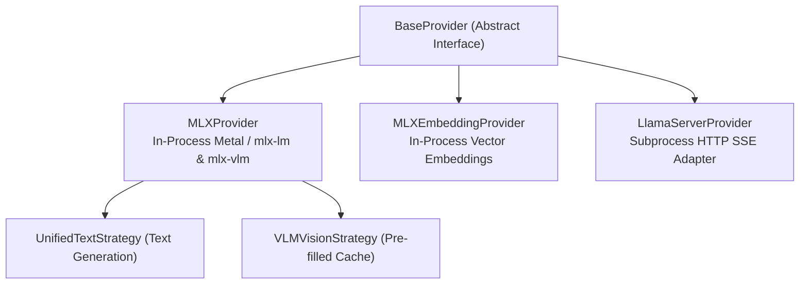

# Providers Architecture

This document explains the provider subsystem in `heylookitsanllm`. Providers bridge abstract generation requests to specific hardware backends and inference engines.

---

## 1. Provider Topology & Contracts

All providers inherit from [`BaseProvider`](../../src/heylook_llm/providers/base.py). Three are registered, but **`mlx_embedding` is unsupported right now**: its `create_chat_completion` raises `NotImplementedError`, and it is not wired to the generation gate, so its forward pass is not serialized against a running generation. Read every provider-behaviour statement below as covering `mlx` and `gguf`.

```python
# src/heylook_llm/config.py
PROVIDER_CONFIG_CLASSES = {
    "mlx": MLXModelConfig,
    "mlx_embedding": MLXEmbeddingModelConfig,
    "gguf": GGUFModelConfig,
}
```



### 1.1. BaseProvider Interface Contract
Only two members are `@abstractmethod`; the rest are concrete base-class behaviour a provider may override.

**Must implement:**
- **`load_model()`**: Initializes the model (in-process MLX weights, or the GGUF `llama-server` process).
- **`create_chat_completion(request: ChatRequest, abort_event=None)`**: Generator yielding `GenerationChunk` objects.

**Declared on the base, but the base bodies are stubs -- the behaviour is in the overrides:**
- **`render_prompt(request) -> str`**: the contract is "render the exact prompt the model sees, without taking an execution slot". The **base raises `NotImplementedError`**; MLX and llama-server implement it.
- **`check_capacity()`**: the contract is "raise `ModelBusyError` (HTTP 503) when the queue is saturated". The **base is a no-op** -- no admission limit -- so a provider that does not override it has none.
- **`unload()`**, **`warmup()`**, **`get_metrics()`**, **`clear_cache()`**, **`get_tokenizer()`**, **`template_info()`**, **`thinking_capable`**, **`effective_thinking()`**, **`generation_queue_stats()`** are likewise declared here with defaults.

Read a stub as a contract, not as inherited behaviour: the embedding provider inherits the no-op `check_capacity` and is therefore ungated.

### 1.2. The `GenerationChunk` Invariant
Providers yield [`GenerationChunk`](../../src/heylook_llm/providers/base.py) dataclass instances:
- **Slotted Fields** (`@dataclass(slots=True)`, complete set): `text`, `token`, `thinking`, `finish_reason`, `prompt_tokens`, `generation_tokens`, `prompt_tps`, `generation_tps`, `peak_memory`, `cached_tokens`, `kv_cache_bytes`, `queue_wait_ms`, `draft_tokens`, `draft_accepted`.
- **`slots=True` is deliberate**: attaching undeclared attributes was the old extension mechanism and must now fail loudly. New telemetry gets a **field here**, absorbed in `perf_collector.ChunkTelemetry.absorb()` -- never an attribute patch at a call site.
- `draft_tokens` / `draft_accepted` are **cumulative running totals** for the request, not per-chunk deltas: `llama-server` reports them on the final timings frame while MLX stamps running counters on every chunk, so the telemetry collector **latches on truthy** and never overwrites a real value with a default. (For monotonic counters that is the same as taking the max, but the mechanism is the truthy latch; only peak memory is an actual `max()`.)
- **Pre-Split Reasoning**: If an engine natively splits reasoning (such as `llama-server`'s `reasoning_content` delta), it is placed directly into `chunk.thinking`.
- **Error Surfacing Policy**: Providers **never** yield error chunks. Internal errors must **raise** typed exceptions:
  - `InvalidGenerationRequest`: client-side error. HTTP 400 **before** headers go out; once streaming has started it becomes an in-band `invalid_request_error` SSE event.
  - `GenerationFailed`: engine/hardware failure. HTTP 500 before headers, an in-band `api_error` SSE event after. `InvalidGenerationRequest` subclasses it.

---

## 2. MLXProvider: Unified Text & Vision

[`MLXProvider`](../../src/heylook_llm/providers/mlx_provider.py) handles both text-only LLMs and multimodal Vision-Language Models (VLMs) running natively on Apple Silicon Metal.

### 2.1. Library Routing via `effective_loader`
Text and vision models in MLX require distinct loader architectures:
- **Text models** use `mlx-lm.utils.load`.
- **Vision models** use `mlx-vlm.utils.load` to load multimodal projectors and vision towers.

[`loader_routing.py`](../../src/heylook_llm/providers/common/loader_routing.py) resolves `effective_loader` to exactly `"mlx-vlm"` or `"mlx-lm"`, and `is_vlm` derives from it. It is driven by the config's `modalities` + `loader` fields, **not** by the raw `vision` bool (which is now a derived mirror of `"vision" in modalities`):
- `loader = "auto"` (the default) sends a non-vision model to `mlx-lm`, and a vision model to `mlx-vlm` **unless** mlx-vlm can be shown *positively* not to register its `model_type`, in which case it falls back to `mlx-lm`. It degrades only on positive non-support.
- An explicit `loader` **forces** the engine -- e.g. `loader = "mlx-lm"` to run a dual-capable VLM strictly as text.
- **The reported `vision` capability derives from the same resolver.** The provider's image guard reads `is_vlm`, so reading the checkpoint's *declaration* instead once let `/v1/models` advertise images that a 400 then refused. One resolver behind both surfaces is what makes them agree by construction; `modalities` still carries the declaration, and description versus served capability are deliberately different fields.
- It is on the wire as `effective_loader` on the `/v1/admin/models` row, derived via `effective_loader_for_config` so it answers for **unloaded** models too -- the provider *attribute* is null unless the model is resident, which is the opposite of what a harness picking engine arms needs. It is null for every non-mlx provider (gguf is one engine, named by `provider`).

Because it reads each model directory's `config.json`, the two admin read routes that build a model response are plain `def` (threadpool), not `async def`.

### 2.2. The Strategy Pattern
Rather than maintaining separate generation loops, `MLXProvider` unifies generation:

#### UnifiedTextStrategy
Handles all text-only inference.
- If the model is a VLM (`is_vlm=True`), the language model component is wrapped in [`LanguageModelLogitsWrapper`](../../src/heylook_llm/providers/common/model_wrappers.py). The vision strategy and warmup build the same wrapper for their own hand-off to the text pipeline -- it is not text-strategy-specific.
- The wrapper adapts `LanguageModelOutput` into raw `.logits` while preserving transparent access to `.layers` and weights, allowing `mlx_lm.generate.stream_generate` to drive it unmodified.

A third strategy, `DiffusionStrategy`, covers mlx-vlm diffusion models; its availability is probed at runtime and the absent-dependency branch is load-bearing.

#### VLMVisionStrategy (Pre-Filled Cache Pattern)
Multimodal requests containing images execute a two-stage forward pass:
1. **Vision Forward Pass**:
   - `mlx_vlm.utils.prepare_inputs` tokenizes the prompt and processes image tensors.
   - The full VLM executes a forward pass over image tokens, filling an initial KV cache.
   - The first token is sampled from the resulting logits.
2. **Continued Text Generation**:
   - The pre-filled KV cache is passed directly to `generation_core.run_generation(pre_filled_cache=...)`.
   - Remaining tokens stream through the exact same text-generation pipeline, gaining full support for samplers (min-p, top-k, repetition penalty), abort handling, and token metrics.

### 2.3. Audio Input Is a Loud Refusal on MLX
Audio towers are stripped at load on the MLX path, so `input_audio` content parts are **gguf-only**. The 400 guard lives in `MLXProvider.create_chat_completion` and must stay loud -- silently dropping an audio part would produce a confident answer about nothing.

### 2.4. Stop-Token & Detokenizer Hardening
- **EOS union at load** ([`stop_tokens.py`](../../src/heylook_llm/providers/common/stop_tokens.py)): a raw HF tokenizer does not absorb `generation_config.json`, so a model whose tokenizer declares one eos while its generation config declares several will generate straight past its own end-of-turn. `MLXProvider` unions the generation-config ids into the tokenizer's set at load. Gemma 4 is the live case.
- Do not confuse that with the **dual-source special-token read** in [`template_info.py`](../../src/heylook_llm/providers/common/template_info.py), which merges `tokenizer_config.json`'s `added_tokens_decoder` with `tokenizer.json`'s `added_tokens` to build an id-to-string map for template validation and the strip set. Different files, different purpose: only the first feeds the stop set generation halts on.
- **Detokenizer Priming**: `load_model` primes `TokenizerWrapper` with `model_path`. This prevents `mlx-lm` from defaulting to the quadratic `NaiveStreamingDetokenizer`, which re-decodes the entire current line on every single token.

---

## 3. MLXEmbeddingProvider

[`MLXEmbeddingProvider`](../../src/heylook_llm/providers/mlx_embedding_provider.py) generates high-throughput dense vector embeddings:
- Uses `mlx_lm.utils._get_classes(config_dict)` -- a **private** API that takes a dict -- to resolve the architecture, then extracts `.model` as the backbone.
- Pooling is `Literal["mean", "cls", "none"]`, default `mean`. `mean` and `cls` return one vector per input; **`none` returns per-token output** instead of pooling. L2 normalization is applied unconditionally in all three cases, so `none` is per-token *and* normalized -- it is not a last-token pooler. Optional dense projection layers sit between pooling and normalization.
- Applies model-specific scaling, such as Gemma's $\sqrt{d_{\text{model}}}$ embedding multiplier (gated on `model_type.startswith("gemma")`).

---

## 4. LlamaServerProvider (GGUF) Overview

[`LlamaServerProvider`](../../src/heylook_llm/providers/llama_server_provider.py) provides out-of-process serving of quantized GGUF models via `llama-server`:
- Spawns one isolated subprocess per resident model.
- Communicates over localhost HTTP via Server-Sent Events (SSE).
- Uses `-np 1` with process-level FIFO queue synchronization.
- Pre-splits reasoning traces via `reasoning_content`.
- Implements the chat template ladder: explicit path, then the operator override beside the weights, then the publisher sidecar, then the GGUF-embedded template.

*(For the complete deep dive on building `llama-server`, process lifecycle, CLI flags, and parameter resolution, see [**Llama-Server & GGUF Deep Dive**](./llama_server_build_and_spawn.md).)*

---

## 5. Reasoning Parsers & Stream Separation

Models format their internal reasoning in diverse, vendor-specific ways. The parser subsystem ([`reasoning_parser.py`](../../src/heylook_llm/reasoning_parser.py)) separates reasoning thoughts from final assistant content:

`select_reasoning_parser()` picks exactly one of **four** routing parsers off `ModelTemplateInfo`, in this order:

| Engine / Family | Selector | Routing Parser | Handling |
| :--- | :--- | :--- | :--- |
| **gpt-oss / harmony** | `has_harmony_structure` | `HarmonyChannelParser` | Tracks harmony channel markers. **Both** `analysis` and `commentary` route to thinking; everything else is text. |
| **Gemma 4** | `has_gemma_channel_structure` | `GemmaChannelParser` | Same shape, gemma's own thought/content channels. |
| **DeepSeek / Qwen** | `has_thinking_markers` | `HybridThinkingParser` (lives in `thinking_parser.py`) | State machine over `<think>` / `</think>`. |
| **GGUF (`llama-server`)**, and any model with none of the above | *(fallthrough)* | `PassThroughParser` | The provider's `template_info()` is `None`, so routing is pass-through by construction. `llama-server` has already pre-split `reasoning_content`; re-parsing another engine's split output is exactly what this avoids. |

Two selection subtleties, both about where a stream *starts*:
- `prefills_thinking` is consulted in the **marker branch only** -- the channel parsers never look at it. There, a template that pre-fills an unclosed `<think>` means the model's output begins **inside** the block, so the parser starts in thinking state, but only when thinking is actually enabled *and* the request is not a **continuation**. A continuation has no generation prompt at all, so nothing opened a block, and a parser armed that way would misfile the whole continuation as thinking.
- `resumes_thinking` is the one continuation that *does* start inside the block: the final assistant message carries thinking and no content, so the provider reopened the block. All three routing parsers accept it -- harmony starts inside `analysis`, gemma inside `thought`, the marker parser inside `<think>`.

### StripSpecials Wrapper
Stripping is **not** each parser's job. Declared control tokens (including non-`<`-shaped families such as Mistral's `[INST]`) are removed by one wrapper, [`StripSpecials`](../../src/heylook_llm/reasoning_parser.py), composed over whichever routing parser was selected -- and only when the model declares specials, so a model declaring none gets the bare parser.

It strips **after** routing, so the inner parser still sees the raw stream its state machine was written for. Its holdback is a **prefix-set membership test, not a fixed-size buffer**: the held-back tail is the longest suffix of the emitted text that is still a proper prefix of some declared special. That is what makes it correct regardless of how long a special is relative to the inner parser's own structural tokens -- an inner parser's buffering can emit a control token in two halves across separate deltas, and a per-delta `sub()` misses both.

`strip_specials=False` composes no wrapper at all, for the frontend's "Show special tokens" display preference. Routing is unaffected either way: a routing parser still consumes its own structural tokens, because those are what it splits with.

Behaviour is pinned by **properties**, not examples (`TestParserInvariants`): output is invariant to how the stream was chunked, and text carrying no structural tokens survives intact.
